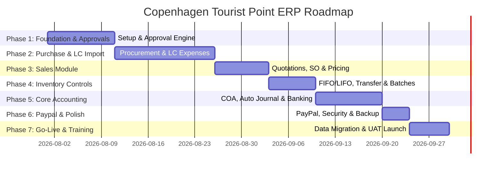

# 🚀 Copenhagen Tourist Point (b2bviking.com) — ERP Implementation & Development Plan

**Project Name:** Enterprise Resource Planning (ERP) System Transformation  
**Platform:** Custom Laravel Enterprise Framework  
**Target System:** Copenhagen Tourist Point ([b2bviking.com](https://b2bviking.com))  
**Total Development Period:** 60 Active Working Days (~80 Calendar Days)  
**Document Version:** 1.0 (Final Executive Proposal)

---

## 📌 Executive Summary (সংক্ষিপ্ত বিবরণ)

এই প্রজেক্ট প্ল্যানটি **Copenhagen Tourist Point (b2bviking.com)**-এর ব্যবসায়িক পরিচালনা, লোকাল ও ইমপোর্ট পারচেজ, ইনভেন্টরি, সেলস এবং সম্পূর্ণ ফিন্যান্সিয়াল অ্যাকাউন্টিংকে একটি সেন্ট্রালাইজড ও স্বয়ংক্রিয় লারাভেল ইআরপি (Laravel ERP) সিস্টেমে রূপান্তর করার জন্য তৈরি করা হয়েছে।

প্রতিটি মডিউল বহু-স্তরীয় অ্যাপ্রুভাল প্রসেস (Multi-level Approval Workflow), রিয়েল-টাইম ডাটা ট্র্যাকিং এবং আন্তর্জাতিক মানদণ্ড মেনে ডিজাইন করা হয়েছে।

---

## 🛠️ Module-wise Scope & Deliverables (মডিউলভিত্তিক কাজের বিবরণ)

### 🔹 Module 0: Foundation & Core Setup (মৌলিক অবকাঠামো)
মুল সিস্টেমের নিরাপত্তা, অ্যাক্সেস কন্ট্রোল ও মাস্টার ডাটা তৈরি।
* **0.1 Role-Based Access Control (RBAC):** ইউজার, রোল ও পারমিশন কন্ট্রোল (অ্যাডমিন, পারচেজ ম্যানেজার, একাউন্টেন্ট, ওয়্যারহাউজ স্টাফ ইত্যাদি)।
* **0.2 Dynamic Multi-Level Approval Engine:** কোম্পানিভিত্তিক ডাইনামিক অনুমোদন ব্যবস্থা (SR, PR, CS, PO, Stock Transfer এর জন্য ১ থেকে ৫ স্তরের অ্যাপ্রুভাল প্রসেস)।
* **0.3 Master Data Setup:** 
  - Customer & Vendor Master
  - Product & Item Master (Variants, Color, Size, MOQ)
  - Warehouse & Location Master
  - Unit of Measure (UOM)
  - Department, Currency & Company Master
* **0.4 System Alerts & Notifications:** ইমেইল ও অ্যাপ-ভিতরের নোটিফিকেশন (অ্যাপ্রুভাল ও স্টক অ্যালার্ট)।
* **0.5 Audit Log & Activity Trail:** প্রতিটি ব্যবহারকারীর প্রতিটি অ্যাকশনের বিস্তারিত লগ ও ট্র্যাক।
* **0.6 Executive Dashboard:** সিইও ও ম্যানেজারদের জন্য সার্বিক বিজনেস ওভারভিউ ড্যাশবোর্ড।

---

### 🔹 Module 1: Purchase Module (ক্রয় ও আমদানি ব্যবস্থাপনা)

#### 1.1 Local Purchase (স্থানীয় ক্রয়)
* **Store & Purchase Requisitions (SR / PR):** শাখা বা স্টোর থেকে মালামালের রিকোয়েস্ট ও একাধিক স্তরের ডিজিটাল অ্যাপ্রুভাল।
* **RFQ & Vendor Quotations:** ভেন্ডরদের RFQ ইস্যু করা এবং ভেন্ডরদের প্রাপ্ত কোটেশন সিস্টেমে এন্ট্রি করা।
* **Comparison Statement (CS):** ভেন্ডর কোটেশনগুলোর পাশাপাশি তুলনামূলক বিবরণী তৈরি এবং অটোমেটিক সর্বনিম্ন দরদাতা সিলেকশন।
* **Purchase Order (PO):** CS থেকে সরাসরি স্বয়ংক্রিয় PO তৈরি, মাল্টি-লেভেল অ্যাপ্রুভাল এবং সাপ্লায়ারকে সরাসরি ইমেইল পাঠানো।

#### 1.2 Foreign Purchase / Import / LC (আমদানি ও এলসি ব্যবস্থাপনা)
* **Proforma Invoice (PI) & LC Management:** প্রফরমা ইনভয়েস এন্ট্রি এবং এলসি (Letter of Credit) রেজিস্টার।
* **LC Related Expenses:** সকল প্রকার আমদানিকৃত খরচ ট্র্যাকিং (CD, RD, SD, VAT, AIT, AT, LC Margin, LC Opening Charge, Document Handling, Insurance, Transport, Freight, C&F Agent Cost)।
* **Shipment & SIT Tracking:** শিপমেন্ট ইনফরমেশন, পোর্ট নোটিফিকেশন এবং স্টক-ইন-ট্রানজিট (SIT) হিসাব।
* **Goods Receipt Note (GRN) & QC:** ওয়্যারহাউজে মালামাল গ্রহণ এবং কোয়ালিটি চেক (QC)।
* **Landed Cost Engine (Weighted Avg):** পণ্যের প্রকৃত খরচ (Landed Cost) হিসাব করে অটোমেটিক ইউনিট কস্ট ক্যালকুলেশন।

---

### 🔹 Module 2: Sales Module (বিক্রয় ব্যবস্থাপনা)

* **Sales Quotation & Templates:** কাস্টমার কোটেশন তৈরি এবং বারবার ব্যবহারযোগ্য কোটেশন টেমপ্লেট।
* **Sales Order (SO):** কোটেশন থেকে সেলস অর্ডারে রূপান্তর ও মাল্টি-লেভেল অ্যাপ্রুভাল।
* **Invoicing & Incoterms:** সরাসরি ইনভয়েস জেনারেট করা এবং সেলস টার্মস/ইনকোটার্মস নির্ধারণ।
* **Dynamic Pricing & Pricelists:** কাস্টমার টাইপ বা ভলিউম অনুযায়ী আলাদা আলাদা প্রাইসলিস্ট এবং ডাইনামিক ডিসকাউন্ট রুল।
* **Coupons, Gift Cards & Discounts:** প্রোমোশনাল কুপন ও গিফট কার্ড জেনারেশন ও চেকআউট প্রসেসিং।
* **Sales Return & Credit Note:** কাস্টমার রিটার্ন প্রসেস করা এবং একাউন্টিং ক্রেডিট নোট তৈরি।

---

### 🔹 Module 3: Inventory Module (মজুদ পণ্য ব্যবস্থাপনা)

* **Goods Issue & Internal Transfer:** Requisition-এর বিপরীতে স্টোর থেকে পণ্য ইস্যু করা এবং শাখা থেকে শাখায় ইনভেন্টরি ট্রান্সফার (অ্যাপ্রুভালসহ)।
* **FIFO / LIFO / Batch Stock Management:** ব্যাচভিত্তিক স্টক ট্র্যাকিং এবং অটোমেটিক FIFO (First-In, First-Out) ও LIFO মেথড depletion।
* **Reorder Point & Stock Alert:** সর্বনিম্ন স্টক লেভেল সেটিং এবং অটোমেটিক রি-অর্ডার নোটিফিকেশন।
* **Physical Stock Adjustment:** ফিজিক্যাল ইনভেন্টরি গণনা শেষে স্টক অ্যাডজাস্টমেন্ট এন্ট্রি ও অ্যাপ্রুভাল।
* **Month-End Frozen Snapshot:** প্রতি মাস শেষে ইনভেন্টরি ভ্যালুয়েশনের ফিক্সড স্ন্যাপশট রাখা।
* **Vendor & Store Return Management:** সাপ্লায়ারকে মালামাল ফেরত (Debit Note) এবং স্টোরে মালামাল ফেরত প্রসেস।

---

### 🔹 Module 5: Financial Accounting Module (অর্থায়ন ও হিসাববিজ্ঞান)

* **Chart of Accounts (COA):** আন্তর্জাতিক মানসম্মত লেজার অ্যাকাউন্টস ট্র্রি (Asset, Liability, Equity, Income, Expense)।
* **Automated Journal Posting:** পারচেজ, সেলস, পেমেন্ট এবং ইনভেন্টরি ইস্যুর সাথে সাথে স্বয়ংক্রিয় জার্নাল এন্ট্রি।
* **Banking & Reconciliation:** মাল্টি-ব্যাংক একাউন্ট ট্র্যাকিং, পেটি ক্যাশ ব্যবস্থাপনা, ব্যাংক স্টেটমেন্ট ইমপোর্ট এবং পেপ্যাল (PayPal) অটো-রিকনসিলিয়েশন।
* **Fixed Asset & Depreciation:** নির্দিষ্ট সম্পদ রেজিস্টার (Asset Register), সোজা লাইনে অটোমেটিক মাসভিত্তিক অবচয় (Depreciation) হিসাব ও পোস্ট।
* **Analytical Accounting & Cost Centers:** কস্ট সেন্টার (Cost Center) ও এনালাইটিক ট্যাগ অনুযায়ী আয়-ব্যয় ট্র্যাকিং।
* **Financial Reports:** রিয়েল-টাইম ট্রায়াল ব্যালেন্স, লেজার, প্রফিট অ্যান্ড লস (P&L), ব্যালেন্স শিট এবং ক্যাশ ফ্লো স্টেটমেন্ট।

---

## 📅 Project Implementation Timeline (পর্যায়ভিত্তিক কাজের সময়সূচী)

মোট সময়কাল: **৬০ কর্মদিবস** (৮০ ক্যালেন্ডার দিন)

| পর্যায় (Phase) | সময়কাল | মূল ফোকাস ও অর্জিত লক্ষ্য |
|---|---|---|
| **Phase 1: Core Foundation** | দিন ১ - ১০ (১০ দিন) | ডাটাবেজ ৬৯টি মাইগ্রেশন রান, মাস্টার ডাটা এন্ট্রি ও অ্যাপ্রুভাল ইঞ্জিন প্রসেস। |
| **Phase 2: Purchase & Import** | দিন ১১ - ২৫ (১৫ দিন) | RFQ, CS, PO, LC খরচ অ্যালুকেশন, গ্রাজুয়াল Landed Cost এবং GRN প্রসেসিং। |
| **Phase 3: Sales Module** | দিন ২৬ - ৩৩ (৮ দিন) | Sales Order, Quotation, Dynamic Pricelist, Coupon এবং Sales Return। |
| **Phase 4: Inventory Controls** | দিন ৩৪ - ৪০ (৭ দিন) | FIFO/LIFO Batches, Stock Transfer, Reorder Alert এবং Month-end Snapshot। |
| **Phase 5: Core Accounting** | দিন ৪১ - ৫০ (১০ দিন) | Chart of Accounts, Automatic Observer Postings, Bank & Petty Cash, Fixed Assets। |
| **Phase 6: Integrations & QA** | দিন ৫১ - ৫৪ (৪ দিন) | PayPal Payment Webhook, System Backup & Recovery, Performance Testing। |
| **Phase 7: Migration & Go-Live**| দিন ৫৫ - ৬০ (৬ দিন) | পুরাতন ডাটা মাইগ্রেশন, ইউজার ট্রেনিং, ইউএটি (UAT) অনুমোদন এবং প্রডাকশন লাইভ। |

---

## 🎯 Quality Assurance, Migration & Delivery (গুণগত মান ও ডেলিভারি)

1. **User Acceptance Testing (UAT):** ডেভেলপমেন্ট শেষে ক্লায়েন্ট টিম বাস্তব ডাটা দিয়ে টেস্ট করবে।
2. **Historical Data Migration:** ক্লায়েন্টের আগের কাস্টমার, ভেন্ডর, প্রোডাক্ট ও ওপেনিং ব্যালেন্স সিস্টেমে মাইগ্রেট করার জন্য কাস্টম স্ক্রিপ্ট তৈরি।
3. **Staff Training & Manuals:** ওয়্যারহাউজ, পারচেজ ও অ্যাকাউন্টস টিমের জন্য সেশন ও নির্দেশিকা।
4. **Maintenance & Backup:** স্বয়ংক্রিয় দৈনিক ডাটাবেজ ব্যাকআপ ও সিকিউরিটি প্যাচ সেটিং।

---

### ✅ Client Sign-off & Approval (গ্রাহকের স্বাক্ষর ও অনুমোদন)

**Prepared by:** Development & AI Technical Team  
**Approved for Client Review:** Yes  

*কোপেনহেগেন ট্যুরিস্ট পয়েন্ট (b2bviking.com) কর্তৃপক্ষের অনুমোদনের জন্য পেশ করা হলো।*
