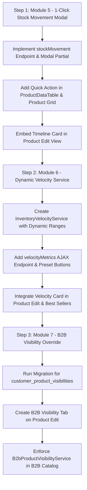

# Client Voice Phase 2 Technical Implementation Plan
**Document:** `docs/00_master_plans/client_voice_phase2_technical_implementation_plan.md`  
**Related Master Plan:** `docs/00_master_plans/client_voice_phase2_stock_velocity_and_b2b_visibility_plan.md`  
**System:** B2B Viking ERP  
**Target Completion:** P1 Modules (Stock Movement & Velocity) followed by P2 (B2B Visibility Override)  
**Status:** Approved for Implementation  

---

## 1. Executive Summary & Architectural Overview

This technical implementation plan translates the client's voice requirements (recorded 2026-09-24) into a robust, enterprise-grade architecture. The requirements address 3 critical operational bottlenecks:

1. **Module 5: 1-Click Stock Inflow & Movement History (No Ledger Hassle):**
   - Eliminates the cumbersome workflow of navigating to `Reports -> Stock Ledger`, selecting filters, and waiting for page loads just to see when and how much stock came in for a product.
   - Provides an instant, lightweight AJAX modal / drawer accessible directly from the Product List (`admin/products`) and the Product Edit page.
2. **Module 6: Dynamic Sell-Through & Consumption Velocity Engine (% Sold):**
   - Implements dynamic sales-to-inflow run-rate calculation ($$ \frac{\text{Sold Qty}}{\text{Total Inflow Qty}} \times 100 $$).
   - Features **Quick Presets** (30d, 90d / 3mo, 180d / 6mo, Annual), **Specific Month & Year**, and **Custom Date Range Picker** with real-time recalculation without page reload.
3. **Module 7: B2B Customer / Outlet Stock Visibility & Availability Override:**
   - Provides granular B2B control to override product stock availability per Company, Customer, Outlet, or Phone Number (`Force In Stock`, `Force Out of Stock`, or `Hide from Catalog`).

---

## 2. File & Component Matrix

| Module | Component Type | Target File | Action | Description |
| :--- | :--- | :--- | :---: | :--- |
| **Module 5** | Blade Partial | `resources/views/backend/product/partials/stock_movement_modal.blade.php` | **[NEW]** | Instant modal displaying recent Stock In/Out timeline, PO references, dates, and balance. |
| **Module 5** | Controller | `app/Http/Controllers/Backend/ProductController.php` | **[MODIFY]** | Add `stockMovement(Product $product)` endpoint returning formatted timeline JSON / HTML. |
| **Module 5** | View | `resources/views/backend/product/index.blade.php` | **[MODIFY]** | Add quick action button & click handler to open the Stock Movement Modal. |
| **Module 5** | View | `resources/views/backend/product/edit.blade.php` | **[MODIFY]** | Embed the Stock Movement & Inflow Timeline as a dedicated section / tab. |
| **Module 5** | DataTable | `app/DataTables/ProductDataTable.php` | **[MODIFY]** | Add quick stock history action trigger icon in the table actions column. |
| **Module 6** | Service | `app/Services/InventoryVelocityService.php` | **[NEW]** | Pure service computing sales velocity, sell-through %, and turnover classifications for any period. |
| **Module 6** | Blade Partial | `resources/views/backend/product/partials/velocity_calculator_card.blade.php` | **[NEW]** | Interactive card with Quick Presets, Month-Year picker, and Date Range for real-time recalculation. |
| **Module 6** | Controller | `app/Http/Controllers/Backend/ProductController.php` | **[MODIFY]** | Add `velocityMetrics(Request $request, Product $product)` returning real-time metrics. |
| **Module 6** | Controller | `app/Http/Controllers/Backend/ReportController.php` | **[MODIFY]** | Integrate velocity service into Best Sellers & Reorder Replenishment reports. |
| **Module 7** | Migration | `database/migrations/2026_09_24_170000_create_customer_product_visibilities_table.php` | **[NEW]** | Table storing customer/outlet-specific stock override rules. |
| **Module 7** | Model | `app/Models/CustomerProductVisibility.php` | **[NEW]** | Eloquent model with relations to `Product`, `User`, `Company`, `Outlet`. |
| **Module 7** | Blade Partial | `resources/views/backend/product/partials/b2b_visibility_tab.blade.php` | **[NEW]** | Admin management tab on Product Edit page to configure selective visibility. |
| **Module 7** | Controller | `app/Http/Controllers/Backend/ProductController.php` | **[MODIFY]** | Add endpoints to save and delete customer visibility overrides. |
| **Module 7** | Service / Helper | `app/Services/B2bProductVisibilityService.php` | **[NEW]** | Resolves whether a product is In Stock / Out of Stock / Hidden for a given buyer. |
| **Routes** | Route File | `routes/web.php` | **[MODIFY]** | Register backend routes for stock movement, velocity metrics, and B2B visibility rules. |

---

## 3. Detailed Technical Specifications

### Module 5: 1-Click Stock Inflow & Movement History

#### 3.1. Controller Endpoint (`ProductController.php`)
```php
/**
 * Return recent stock movement & inflow timeline for a product via AJAX.
 */
public function stockMovement(Request $request, Product $product)
{
    $movements = StockLedger::where('product_id', $product->id)
        ->with(['outlet', 'batch'])
        ->orderBy('date', 'desc')
        ->orderBy('id', 'desc')
        ->limit(30)
        ->get();

    // Also fetch recent purchase receipts for detailed vendor & PO context
    $purchaseInflows = PurchaseDetail::where('product_id', $product->id)
        ->whereHas('purchase', function($q) {
            $q->whereIn('status', ['goods_received', 'approved', 'shipped']);
        })
        ->with(['purchase.vendor'])
        ->latest()
        ->limit(10)
        ->get();

    $currentStock = $product->inventoryStocks()->sum('qty');
    $lifetimeInflow = StockLedger::where('product_id', $product->id)->sum('in_qty');
    $lifetimeOutflow = StockLedger::where('product_id', $product->id)->sum('out_qty');

    if ($request->ajax()) {
        return view('backend.product.partials.stock_movement_modal', compact(
            'product', 'movements', 'purchaseInflows', 'currentStock', 'lifetimeInflow', 'lifetimeOutflow'
        ))->render();
    }

    return response()->json([
        'product' => $product,
        'current_stock' => $currentStock,
        'lifetime_inflow' => $lifetimeInflow,
        'lifetime_outflow' => $lifetimeOutflow
    ]);
}
```

#### 3.2. Modal UI (`resources/views/backend/product/partials/stock_movement_modal.blade.php`)
- **Header:** Product Name, SKU, Category, Current Physical Stock (large green/amber pill), Unit.
- **KPI Summary Ribbon:**
  - 📥 **Lifetime Inflow:** `1,250 pcs`
  - 📤 **Lifetime Outflow:** `980 pcs`
  - 📦 **Current Available Stock:** `270 pcs`
  - ⚡ **30-Day Velocity:** `+45 pcs sold (16.7%)`
- **Tab 1: Stock Inflows (When & How Many Arrived):**
  - Date Received
  - PO # / Invoice #
  - Supplier / Vendor Name
  - Qty Received (`+500 pcs`)
  - Unit Cost & Landed Cost
- **Tab 2: Comprehensive Movement Ledger (In & Out Flow):**
  - Date
  - Transaction Type (`Purchase`, `Sale Order`, `Transfer`, `Adjustment`)
  - Reference Document
  - Outlet / Location
  - In Qty / Out Qty
  - Running Balance

---

### Module 6: Dynamic Sell-Through & Consumption Velocity Engine

#### 3.1. Service Architecture (`app/Services/InventoryVelocityService.php`)
```php
namespace App\Services;

use App\Models\Product;
use App\Models\StockLedger;
use App\Models\OrderItem;
use Carbon\Carbon;

class InventoryVelocityService
{
    /**
     * Compute sell-through velocity % for a product over any dynamic period.
     *
     * @param int $productId
     * @param string|null $preset ('30_days', '90_days', '180_days', '365_days', 'custom')
     * @param string|null $startDate
     * @param string|null $endDate
     * @param int|null $month
     * @param int|null $year
     * @return array
     */
    public function calculateVelocity(
        int $productId,
        ?string $preset = '90_days',
        ?string $startDate = null,
        ?string $endDate = null,
        ?int $month = null,
        ?int $year = null
    ): array {
        // Resolve date range
        [$start, $end, $periodLabel] = $this->resolveDateRange($preset, $startDate, $endDate, $month, $year);

        // 1. Total Quantity Sold in period (from completed orders)
        $soldQty = OrderItem::where('product_id', $productId)
            ->whereHas('order', function ($q) use ($start, $end) {
                $q->whereBetween('order_date', [$start, $end])
                  ->whereIn('order_status', ['completed', 'delivered', 'processing']);
            })
            ->sum('qty');

        // 2. Total Inflow in period (from StockLedger)
        $inflowInPeriod = StockLedger::where('product_id', $productId)
            ->whereBetween('date', [$start->toDateString(), $end->toDateString()])
            ->sum('in_qty');

        // 3. Fallback: If no new inflow occurred inside the window, use total lifetime inflow or peak inventory
        $totalBaselineInflow = $inflowInPeriod > 0
            ? $inflowInPeriod
            : (StockLedger::where('product_id', $productId)->sum('in_qty') ?: 1);

        // 4. Calculate Sell-Through Rate %
        $sellThroughRate = round(($soldQty / $totalBaselineInflow) * 100, 1);

        // 5. Monthly Run-Rate (Average units sold per 30 days)
        $daysInWindow = max(1, $start->diffInDays($end));
        $monthlyRunRate = round(($soldQty / $daysInWindow) * 30, 1);

        // 6. Velocity Classification
        $classification = $this->classifyVelocity($sellThroughRate, $daysInWindow);

        return [
            'product_id' => $productId,
            'preset' => $preset,
            'start_date' => $start->toDateString(),
            'end_date' => $end->toDateString(),
            'period_label' => $periodLabel,
            'days_in_window' => $daysInWindow,
            'sold_qty' => (float)$soldQty,
            'inflow_qty' => (float)$totalBaselineInflow,
            'sell_through_rate' => $sellThroughRate,
            'monthly_run_rate' => $monthlyRunRate,
            'classification' => $classification
        ];
    }

    protected function resolveDateRange($preset, $startDate, $endDate, $month, $year): array
    {
        $now = Carbon::now();

        if ($month && $year) {
            $start = Carbon::createFromDate($year, $month, 1)->startOfMonth();
            $end = $start->copy()->endOfMonth();
            return [$start, $end, $start->format('F Y')];
        }

        if ($year && !$month) {
            $start = Carbon::createFromDate($year, 1, 1)->startOfYear();
            $end = $start->copy()->endOfYear();
            return [$start, $end, "Year " . $year];
        }

        if ($startDate && $endDate) {
            $start = Carbon::parse($startDate)->startOfDay();
            $end = Carbon::parse($endDate)->endOfDay();
            return [$start, $end, $start->format('d M Y') . ' - ' . $end->format('d M Y')];
        }

        return match ($preset) {
            '30_days' => [$now->copy()->subDays(30)->startOfDay(), $now->copy()->endOfDay(), 'Last 30 Days (1 Mo)'],
            '180_days' => [$now->copy()->subDays(180)->startOfDay(), $now->copy()->endOfDay(), 'Last 180 Days (6 Mo)'],
            '365_days' => [$now->copy()->subDays(365)->startOfDay(), $now->copy()->endOfDay(), 'Last 365 Days (1 Yr)'],
            default => [$now->copy()->subDays(90)->startOfDay(), $now->copy()->endOfDay(), 'Last 90 Days (3 Mo)'],
        };
    }

    protected function classifyVelocity(float $rate, int $days): array
    {
        if ($rate >= 50) {
            return ['badge' => 'badge-success', 'icon' => 'fas fa-fire text-danger', 'label' => 'High Velocity (Fast Mover)', 'advice' => 'Increase Reorder Volume'];
        } elseif ($rate >= 20) {
            return ['badge' => 'badge-primary', 'icon' => 'fas fa-balance-scale text-primary', 'label' => 'Steady Mover', 'advice' => 'Maintain Standard Reorder'];
        } elseif ($rate >= 5) {
            return ['badge' => 'badge-warning', 'icon' => 'fas fa-hourglass-half text-warning', 'label' => 'Slow Mover', 'advice' => 'Reduce Reorder Ratio'];
        } else {
            return ['badge' => 'badge-danger', 'icon' => 'fas fa-skull text-secondary', 'label' => 'Dead Stock Risk', 'advice' => 'Liquidate or Freeze Orders'];
        }
    }
}
```

#### 3.2. Real-Time AJAX Recalculation Endpoint
- Endpoint: `GET /admin/products/{product}/velocity-metrics`
- Parameters: `preset`, `start_date`, `end_date`, `month`, `year`
- Returns: JSON payload with dynamic `sell_through_rate`, `sold_qty`, `inflow_qty`, and badge classes.
- Allows user to toggle between:
  - Button 1: **30 Days**
  - Button 2: **90 Days (3 Months)**
  - Button 3: **180 Days (6 Months)**
  - Button 4: **Annual**
  - Dropdown: **Select Month / Year**
  - Date Range: **Datepicker inputs**
  All update instantly via jQuery AJAX with zero full-page reload!

---

### Module 7: B2B Customer / Outlet Stock Visibility Override

#### 3.1. Database Migration (`customer_product_visibilities`)
```php
Schema::create('customer_product_visibilities', function (Blueprint $table) {
    $table->id();
    $table->foreignId('product_id')->constrained()->cascadeOnDelete();
    
    // Target buyer (One of these can be set)
    $table->foreignId('user_id')->nullable()->constrained()->nullOnDelete(); // Specific Customer
    $table->foreignId('company_id')->nullable()->constrained()->nullOnDelete(); // Specific Company
    $table->foreignId('outlet_id')->nullable()->constrained()->nullOnDelete(); // Specific Outlet
    $table->string('phone_number')->nullable()->index(); // Quick match by phone
    
    // Visibility rule
    $table->enum('visibility_mode', ['force_in_stock', 'force_out_of_stock', 'hide_product'])->default('force_in_stock');
    $table->integer('reserved_qty')->nullable()->default(null);
    $table->text('notes')->nullable();
    
    $table->foreignId('created_by')->nullable()->constrained('users')->nullOnDelete();
    $table->timestamps();

    // Indexes for fast lookup
    $table->index(['product_id', 'user_id']);
    $table->index(['product_id', 'company_id']);
    $table->index(['product_id', 'outlet_id']);
});
```

#### 3.2. Visibility Resolution Service (`B2bProductVisibilityService.php`)
```php
namespace App\Services;

use App\Models\Product;
use App\Models\CustomerProductVisibility;
use App\Models\User;

class B2bProductVisibilityService
{
    /**
     * Determine effective stock status for a given customer or company.
     *
     * @param Product $product
     * @param User|null $customer
     * @return array ['is_visible' => bool, 'stock_status' => 'in_stock'|'out_of_stock', 'is_overridden' => bool]
     */
    public static function resolveAvailability(Product $product, ?User $customer = null): array
    {
        if (!$customer) {
            $realStock = $product->inventoryStocks()->sum('qty');
            return [
                'is_visible' => true,
                'stock_status' => $realStock > 0 ? 'in_stock' : 'out_of_stock',
                'is_overridden' => false
            ];
        }

        // Check for specific override
        $override = CustomerProductVisibility::where('product_id', $product->id)
            ->where(function ($q) use ($customer) {
                $q->where('user_id', $customer->id)
                  ->when($customer->company_id, fn($sq) => $sq->orWhere('company_id', $customer->company_id))
                  ->when($customer->outlet_id, fn($sq) => $sq->orWhere('outlet_id', $customer->outlet_id))
                  ->when($customer->phone, fn($sq) => $sq->orWhere('phone_number', $customer->phone));
            })
            ->first();

        if ($override) {
            if ($override->visibility_mode === 'hide_product') {
                return ['is_visible' => false, 'stock_status' => 'hidden', 'is_overridden' => true];
            }
            if ($override->visibility_mode === 'force_in_stock') {
                return ['is_visible' => true, 'stock_status' => 'in_stock', 'is_overridden' => true];
            }
            if ($override->visibility_mode === 'force_out_of_stock') {
                return ['is_visible' => true, 'stock_status' => 'out_of_stock', 'is_overridden' => true];
            }
        }

        // Fallback to real inventory
        $realStock = $product->inventoryStocks()->sum('qty');
        return [
            'is_visible' => true,
            'stock_status' => $realStock > 0 ? 'in_stock' : 'out_of_stock',
            'is_overridden' => false
        ];
    }
}
```

---

## 4. Execution Roadmap & Sequence



---

## 5. Verification & Testing Plan

1. **Unit & Feature Tests:**
   - `InventoryVelocityServiceTest.php`:
     - Test 30-day, 90-day, 180-day calculations with known orders.
     - Test month/year selector calculation.
     - Test custom date range ($start \to end$).
     - Test zero-sales and zero-inflow edge cases (no division-by-zero).
   - `ProductStockMovementTest.php`:
     - Test `GET /admin/products/{id}/stock-movement` returns valid HTML modal and JSON.
   - `CustomerProductVisibilityTest.php`:
     - Test `force_in_stock` override for zero-stock product.
     - Test `force_out_of_stock` override for high-stock product.
2. **Browser Validation:**
   - Verify modal opens smoothly in `< 200ms` on clicking the history icon.
   - Verify preset buttons (30d, 90d, 180d, Annual) update the velocity numbers instantly without page reload.
   - Verify B2B customer visibility rules correctly reflect on the buyer view.
