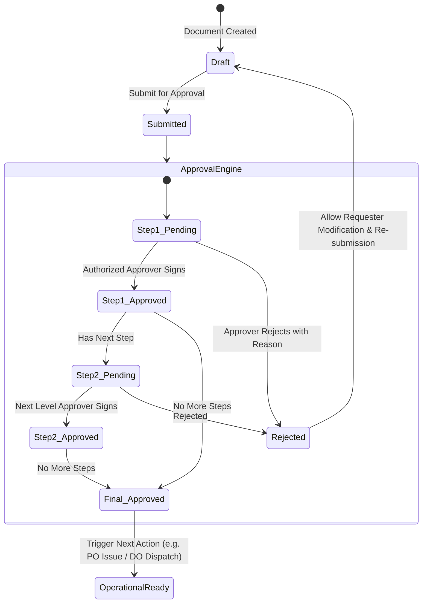

# 🏗️ Spec: Foundation, Multi-Company & Polymorphic Approval Engine
**Module:** `01_architecture`  
**Phase:** Phase 1 (Core System Architecture)  
**Status:** Implemented & Verified  
**Document Standard:** Spec-Driven Development (SDD) Specification

---

## 1. Business Objective & Context
To support an international multi-outlet B2B wholesale network (Copenhagen Tourist Point / b2bviking.com), the ERP requires an unshakeable enterprise foundation featuring:
1. **Multi-Company & Outlet Isolation:** Strict operational separation between Central Headquarters, Warehouses, and 20+ Franchise/Company-owned retail outlets.
2. **Dynamic Polymorphic Multi-Level Approval Engine:** Odoo/SAP-style dynamic approval chains (1 to 5 levels) configurable per document type (Store Requisitions, Purchase Requisitions, Comparison Statements, Purchase Orders, Sales Orders, Stock Transfers, and Stock Adjustments).
3. **Enterprise RBAC:** Granular role-based security protecting commercial pricing, stock movements, and financial journals.

---

## 2. Database Schema & Invariants

```text
SCHEMA INVARIANTS:
├── companies
│   ├── id (PK), name, email, phone, vat_number, currency_id (FK), address, status
│   └── Invariant: Exactly one default company active for master consolidation.
│
├── outlets
│   ├── id (PK), company_id (FK), name, code, phone, address, is_warehouse, status
│   └── Invariant: Code must be unique alphanumeric (e.g., WH-01, OUT-02).
│
├── departments
│   ├── id (PK), company_id (FK), name, code, manager_id (FK -> users), status
│
├── currencies
│   ├── id (PK), name, code (ISO 4217: DKK, USD, EUR, CNY, BDT), symbol, exchange_rate, is_default, status
│   └── Invariant: Default currency always has exchange_rate = 1.000000.
│
├── approval_workflows
│   ├── id (PK), name, document_type, company_id (FK), department_id (nullable FK), min_amount, max_amount, status
│   └── Invariant: document_type enum ('store_requisition', 'purchase_requisition', 'comparison_statement', 'purchase_order', 'sales_order', 'stock_transfer', 'stock_adjustment').
│
├── approval_steps
│   ├── id (PK), approval_workflow_id (FK), step_order (int), role_id (FK -> roles), user_id (nullable FK), require_all_approvers (bool)
│   └── Invariant: step_order must be sequential (1, 2, 3...) with unique constraint per workflow.
│
└── approvals (Polymorphic Execution Log)
    ├── id (PK), approvable_type (morphs: Purchase, Order, StockTransfer, etc.), approvable_id (morphs),
    │   approval_step_id (FK), user_id (FK -> users), status ('pending', 'approved', 'rejected'), comments, approved_at
    └── Invariant: An approval record is permanently immutable once approved_at is timestamped.
```

---

## 3. Polymorphic Approval State Machine



---

## 4. Service Contracts & Interfaces

### 4.1 `ApprovalWorkflowService` Contract
```php
namespace App\Services\ApprovalWorkflow;

interface ApprovalWorkflowServiceInterface
{
    /**
     * Submit an approvable model to the dynamic workflow engine.
     */
    public function submitForApproval(Model $approvable, int $userId): bool;

    /**
     * Approve the current step in the chain.
     */
    public function approve(Model $approvable, int $userId, ?string $comments = null): bool;

    /**
     * Reject the document, halting the workflow.
     */
    public function reject(Model $approvable, int $userId, string $reason): bool;

    /**
     * Check if a given user is authorized to act on the current pending step.
     */
    public function canUserApprove(Model $approvable, int $userId): bool;
}
```

---

## 5. Security & Concurrency Guards
1. **Atomic Step Locking:** Approval resolution must wrap status mutation in `DB::transaction()` with `lockForUpdate()` on the parent model to prevent dual-approval race conditions.
2. **Self-Approval Prohibition:** Requisition creators cannot approve their own requests unless explicitly configured for executive super-admins.
3. **Audit Trail Logging:** Every status change automatically writes to `audit_logs` tracking IP, user ID, old status, new status, and payload diff.

---

## 6. Acceptance Criteria & Test Scenarios

- [x] **AC-01:** System seeds 69 core migrations and creates superadmin with Spatie RBAC.
- [x] **AC-02:** Creating a 3-step workflow (Dept Head ➔ Finance ➔ GM) routes a $10,000 Purchase Order sequentially through all 3 approvers.
- [x] **AC-03:** If Approver 2 rejects with a comment, the document status transitions to `rejected` and notifies the creator.
- [x] **AC-04:** Outlets cannot view or modify other outlets' stock unless granted Central Warehouse admin privileges.
