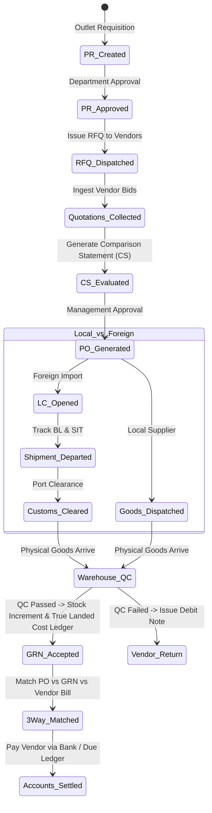

# 🛒 Spec: Enterprise Procurement, Import LC & Landed Costing
**Module:** `02_procurement`  
**Phase:** Phase 2 (Procurement & Import Logistics)  
**Status:** Implemented & Verified  
**Document Standard:** Spec-Driven Development (SDD) Specification

---

## 1. Business Objective & Context
To manage end-to-end local purchasing and international import operations:
1. **Local Procurement:** Requisition (SR/PR) ➔ Multi-vendor RFQ ➔ Comparison Statement (CS) Matrix ➔ Multi-currency Purchase Order (PO).
2. **International Import & LC:** Proforma Invoice (PI) ➔ Letter of Credit (LC) Register ➔ 13 Cost Elements (CD, RD, SD, VAT, AIT, AT, Freight, Insurance, C&F, Bank Charges, Handling) ➔ Shipment Tracking (SIT).
3. **Goods Receipt (GRN) & QC:** Strict over-receipt protection, Quality Inspection (Passed/Partial/Failed), True Landed Cost calculation, and Supplier Ledger integration.

---

## 2. Database Schema & Invariants

```text
SCHEMA INVARIANTS:
├── product_requests (Requisition)
│   ├── id (PK), request_no, user_id (FK), outlet_id (FK), status ('draft','pending','approved','rejected')
│   └── Invariant: Items must belong to active product catalog.
│
├── rfqs (Request for Quotation)
│   ├── id (PK), rfq_no, product_request_id (FK), title, closing_date, status ('draft','sent','closed')
│   ├── rfq_items (product_id, qty, target_price)
│   └── rfq_vendors (vendor_id, sent_at, quotation_received)
│
├── vendor_quotations & items
│   ├── id (PK), rfq_id (FK), vendor_id (FK), quotation_no, currency_id (FK), exchange_rate, total_amount
│   └── Invariant: Exchange rate snapshot taken at the time of quotation submission.
│
├── comparison_statements (CS Matrix)
│   ├── id (PK), cs_no, rfq_id (FK), winning_vendor_id (FK), approval_status ('pending','approved','rejected')
│   └── Invariant: Lowest bidder (L1) auto-computed across normalized system currency.
│
├── purchases (Purchase Orders - PO Register)
│   ├── id (PK), po_no, invoice_no, vendor_id (FK), purchase_type ('local','foreign'), currency_id (FK),
│   │   exchange_rate, approval_status, milestone_status ('draft','po_issued','in_transit','goods_received')
│   └── purchase_details (product_id, variant_id, qty, unit_cost, landed_cost, raw_material_cost, tax_cost, transport_cost, total)
│
├── letters_of_credit (LC Register)
│   ├── id (PK), lc_number, purchase_id (FK), bank_name, issue_date, expiry_date, lc_amount, currency_id (FK), status
│   └── lc_expenses: 13 cost elements (cd, rd, sd, vat, ait, at, lc_margin, opening_charge, doc_handling, insurance, transport, freight, cnf)
│
├── shipments (Logistics & SIT)
│   ├── id (PK), shipment_no, purchase_id (FK), vessel_name, container_no, bl_number, eta_date, etd_date, port_of_loading, port_of_discharge, status ('scheduled','in_transit','arrived','cleared')
│
├── goods_receipts (GRN) & goods_receipt_items
│   ├── id (PK), grn_no, purchase_id (FK), outlet_id (FK), received_by (FK), qc_status ('passed','partial','failed'), remarks
│   └── goods_receipt_items: product_id, variant_id, accepted_qty, rejected_qty, rejection_reason
│   └── Invariant: accepted_qty <= (ordered_qty - previously_received_qty) [Strict Over-Receipt Guard].
│
└── vendor_bills & vendor_returns
    ├── vendor_bills: bill_no, purchase_id, grn_id, total_amount, paid_amount, due_amount, payment_status
    └── vendor_returns: return_no, purchase_id, debit_note_no, total_refund_amount, status ('draft','approved','refunded')
```

---

## 3. Procurement Lifecycle State Machine



---

## 4. Landed Cost Calculation & Unit Allocation

Landed cost per unit is calculated across all customs, freight, and transport expenses:

$$\text{Unit Landed Cost} = \text{Converted Base Cost} + \frac{\text{Total Overhead Expenses (Freight, Customs, C\&F)}}{\text{Total Shipment Value or Weight}} \times \text{Item Cost}$$

---

## 5. Security Guards & Business Invariants

1. **Over-Receipt Guard:** A warehouse clerk cannot receive 105 units if only 100 units were approved on the PO.
2. **Foreign Goods Receipt Lock:** Goods for foreign import orders cannot be received into physical inventory until the shipment status is marked `Customs Cleared`.
3. **Immutable GRN Stock Entries:** When GRN is approved, `StockReceiveService` immediately writes permanent `in_qty` to `stock_ledgers` and updates `inventory_stocks`.

---

## 6. Acceptance Criteria & Test Scenarios

- [x] **AC-01:** Creating an RFQ with 3 vendors allows independent quotation submission in different currencies (USD, CNY, EUR).
- [x] **AC-02:** Comparison Statement normalizes all bids to system currency (DKK) and highlights lowest bidder (L1).
- [x] **AC-03:** Foreign PO allows allocation of 13 LC expense items and calculates Stock-in-Transit (SIT).
- [x] **AC-04:** Submitting GRN for 50 accepted units out of 100 sets PO status to `goods_partial` and increments warehouse stock by exactly 50.
- [x] **AC-05:** Vendor Return generates Debit Note and updates Supplier Ledger balance.
