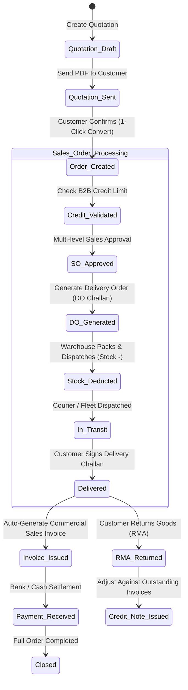

# 📦 Spec: Commercial Sales, Delivery Orders & Pricelists
**Module:** `03_sales_and_fulfillment`  
**Phase:** Phase 3 (Sales & Commercial Fulfillment)  
**Status:** Implemented & Verified  
**Document Standard:** Spec-Driven Development (SDD) Specification

---

## 1. Business Objective & Context
To manage the complete B2B commercial sales and delivery lifecycle:
1. **Quotations & Dynamic Pricing:** Sales Quotations with custom templates, multi-tier customer pricelists, and margin rules.
2. **Sales Orders & Credit Control:** 1-click quote-to-order conversion, multi-level sales approval, and B2B credit limit validation.
3. **Delivery Orders (DO / Formal Challan):** Decoupled fulfillment engine generating formal delivery challans, updating `InventoryStock`, and supporting partial dispatches.
4. **Invoicing & Customer Ledgers:** Commercial invoices, multi-mode payment settlements, sales returns, and credit notes.

---

## 2. Database Schema & Invariants

```text
SCHEMA INVARIANTS:
├── sales_quotations & items
│   ├── id (PK), quotation_no, user_id (FK), customer_id (FK), pricelist_id (FK), total_amount, status ('draft','sent','approved','converted','expired')
│   └── sales_quotation_items: product_id, variant_id, qty, unit_price, discount_amount, subtotal
│
├── quotation_templates
│   ├── id (PK), name, description, is_active
│
├── pricelists & pricelist_items
│   ├── pricelists: name, code, currency_id (FK), type ('fixed','multiplier','percentage_discount'), is_default, status
│   └── pricelist_items: product_id, variant_id, min_quantity, fixed_price, multiplier_value, discount_percent
│
├── orders (Sales Orders - SO Register)
│   ├── id (PK), order_no, user_id (FK), customer_id (FK), outlet_id (FK), sales_quotation_id (nullable FK),
│   │   total_amount, paid_amount, due_amount, payment_status ('unpaid','partial','paid'),
│   │   fulfillment_status ('unfulfilled','partially_fulfilled','fulfilled'), status ('pending','approved','completed','cancelled')
│   └── order_items: product_id, variant_id, quantity, unit_price, total_price
│
├── delivery_orders (DO / Formal Challan)
│   ├── id (PK), do_number, order_id (FK), outlet_id (FK), dispatched_by (FK), recipient_name, courier_name, tracking_no, status ('draft','dispatched','delivered','cancelled')
│   └── delivery_order_items: product_id, variant_id, ordered_qty, dispatched_qty
│   └── Invariant: dispatched_qty <= (ordered_qty - previously_dispatched_qty) [Over-Dispatch Guard].
│
├── sales_invoices & items
│   ├── id (PK), invoice_no, order_id (FK), delivery_order_id (nullable FK), customer_id (FK), total_amount, paid_amount, due_amount, payment_status
│
├── customer_payments & payment_allocations
│   ├── customer_payments: payment_no, customer_id (FK), amount, payment_method, transaction_id, payment_date
│   └── payment_allocations: customer_payment_id (FK), sales_invoice_id (FK), allocated_amount
│
└── sales_returns & credit_notes
    ├── sales_returns: return_no, order_id (FK), customer_id (FK), reason, total_amount, status ('draft','approved','refunded')
    └── credit_notes: credit_note_no, sales_return_id (FK), customer_id (FK), total_amount, remaining_balance, status
```

---

## 3. Commercial Sales & Fulfillment State Machine



---

## 4. B2B Pricing Resolution Hierarchy

When a customer or outlet adds products to cart or creates a quotation:
1. **Tier 1 (Customer-Specific Pricelist):** Check if customer has an assigned `Pricelist`.
2. **Tier 2 (Volume Price Breaks):** If order quantity $\ge$ `min_quantity` in `pricelist_items`.
3. **Tier 3 (Pricing Rule Multipliers):** Base Landed Cost $\times$ `outlet_multiplier` or `sale_multiplier`.
4. **Tier 4 (Catalog Default Price):** Base `product.price` or `product.outlet_price`.

---

## 5. Security & Stock Integrity Invariants

1. **Strict Delivery Over-Dispatch Guard:** A delivery challan cannot dispatch more units than remain unfulfilled on the sales order.
2. **Atomic Physical Stock Deduction:** When DO status transitions to `dispatched`, `InventoryStock` is decremented inside a transaction with `lockForUpdate()` and an immutable OUT entry is written to `stock_ledgers`.
3. **Automatic Credit Note Offsetting:** Credit Notes automatically offset open invoice balances or sit as customer credit on the party ledger.

---

## 6. Acceptance Criteria & Test Scenarios

- [x] **AC-01:** Quotation template renders branded PDF and converts to Sales Order in 1 click.
- [x] **AC-02:** Creating a Delivery Order for 10 units of Product A decrements 10 units from Central Warehouse and writes `StockLedger` entry with reference type `delivery_order`.
- [x] **AC-03:** Disallow DO dispatch if physical warehouse stock is insufficient (`InsufficientStockException`).
- [x] **AC-04:** Commercial Invoice generates with tax breakdowns, payment receipts, and customer statement ledger update.
