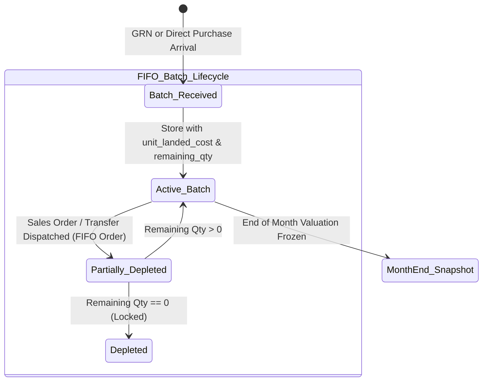
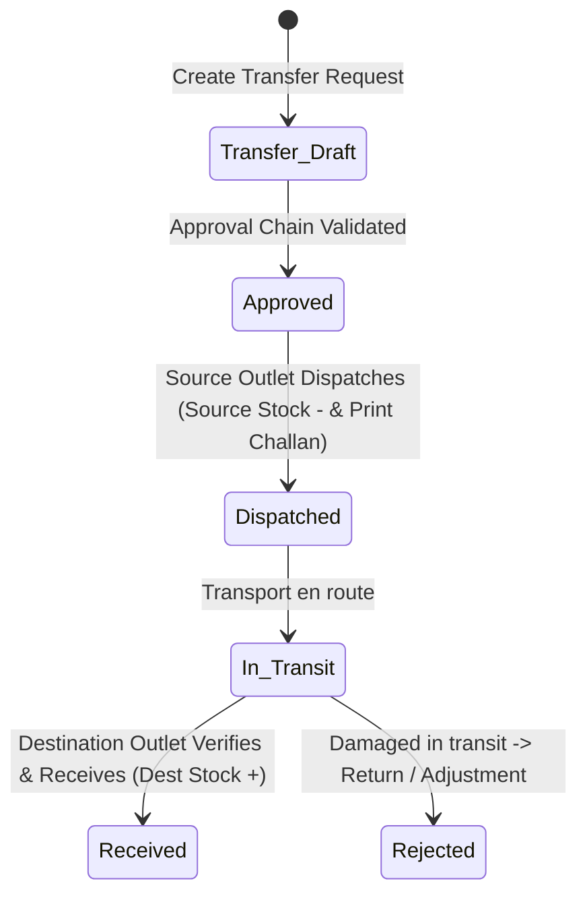

# 🏭 Spec: Advanced Inventory, FIFO Batches & WMS
**Module:** `04_inventory_and_wms`  
**Phase:** Phase 4 (Inventory & Stock Controls)  
**Status:** In Progress / Target Architecture  
**Document Standard:** Spec-Driven Development (SDD) Specification

---

## 1. Business Objective & Context
To ensure 100% audit-compliant warehouse operations, accurate physical stock tracking, and true profit margins:
1. **FIFO Stock Batches & Costing Engine:** Track every receipt as an isolated lot/batch with its exact `unit_landed_cost`. When goods are sold, cost is depleted in sequential FIFO order (oldest batch first).
2. **Pricing & Margin Bridge:** Automatically calculate or manually set Fixed Retail Price and Wholesale Price at the moment of batch receipt using Pricing Rules.
3. **Multi-Stage Stock Transfers:** Outlet-to-outlet and warehouse-to-outlet stock movements with in-transit status and PDF delivery challans.
4. **Physical Stock Adjustments & Month-End Snapshots:** Damage write-offs, audit variance reconciliations, and frozen monthly closing valuations.

---

## 2. Database Schema & Invariants

```text
SCHEMA INVARIANTS:
├── inventory_stocks (Physical Location Stock)
│   ├── id (PK), outlet_id (FK), product_id (FK), variant_id (nullable FK), quantity (decimal:12,4)
│   └── Invariant: Unique constraint on (outlet_id, product_id, variant_id). Quantity cannot be negative.
│
├── stock_batches (FIFO / LIFO Lot Engine)
│   ├── id (PK), batch_no, outlet_id (FK), product_id (FK), variant_id (nullable FK),
│   │   purchase_id (nullable FK), goods_receipt_id (nullable FK), vendor_id (nullable FK),
│   │   received_qty (decimal), remaining_qty (decimal),
│   │   raw_cost (decimal), tax_duty_cost (decimal), transport_freight_cost (decimal),
│   │   unit_landed_cost (decimal), unit_retail_price (decimal), unit_wholesale_price (decimal),
│   │   received_date (date), expiry_date (nullable date), status ('active','depleted','quarantined')
│   └── Invariant: remaining_qty >= 0. When remaining_qty == 0, status transitions to 'depleted'.
│
├── stock_transfers & items (3-Stage Transfer Lifecycle)
│   ├── stock_transfers: id (PK), transfer_no, source_outlet_id (FK), destination_outlet_id (FK),
│   │   requested_by (FK), dispatched_by (nullable FK), received_by (nullable FK),
│   │   status ('draft','pending_approval','approved','dispatched','in_transit','received','cancelled')
│   └── stock_transfer_items: product_id, variant_id, requested_qty, dispatched_qty, received_qty
│
├── stock_adjustments & items
│   ├── stock_adjustments: id (PK), adjustment_no, outlet_id (FK), adjustment_type ('damage','expiry','surplus','audit_variance'),
│   │   adjusted_by (FK), approved_by (nullable FK), status ('draft','pending_approval','approved','rejected')
│   └── stock_adjustment_items: product_id, variant_id, action ('addition','subtraction'), quantity, unit_cost, total_value, reason
│
├── stock_ledgers (Permanent Immutable Audit Log)
│   ├── id (PK), outlet_id (FK), product_id (FK), variant_id (nullable FK), batch_id (nullable FK),
│   │   reference_type ('opening','purchase_grn','delivery_order','transfer_out','transfer_in','adjustment'),
│   │   reference_id, in_qty, out_qty, balance_qty, unit_cost, date, created_at
│   └── Invariant: StockLedger records are NEVER updated or deleted.
│
└── month_end_snapshots
    ├── id (PK), snapshot_date (date: YYYY-MM-DD), outlet_id (FK), product_id (FK), variant_id (nullable FK),
    │   total_quantity, fifo_valuation_amount, average_cost_amount, created_at
```

---

## 3. FIFO Stock Depletion & Valuation State Machine



---

## 4. Multi-Stage Stock Transfer State Machine



---

## 5. Security & Concurrency Invariants

1. **Atomic FIFO Lot Depletion:** Depletion queries must use `SELECT ... FOR UPDATE` ordered by `received_date ASC, id ASC` on `stock_batches` with `remaining_qty > 0`.
2. **Transfer In-Transit Protection:** Goods in transit cannot be used for sales orders at either source or destination outlet until physically received and verified.
3. **No Negative Stock Invariant:** Any operation resulting in `InventoryStock.quantity < 0` immediately rolls back the database transaction with `InsufficientStockException`.

---

## 6. Acceptance Criteria & Test Scenarios

- [ ] **AC-01:** Receiving 100 units @ 10 DKK and later 100 units @ 12 DKK creates Batch #1 and Batch #2.
- [ ] **AC-02:** Selling 150 units auto-depletes 100 units from Batch #1 (COGS = 1,000 DKK) and 50 units from Batch #2 (COGS = 600 DKK), total COGS = 1,600 DKK.
- [ ] **AC-03:** Stock Transfer from Main Hub to Outlet A transitions `Draft` ➔ `Dispatched` (Hub -10) ➔ `Received` (Outlet A +10) with 100% ledger balance.
- [ ] **AC-04:** Stock Adjustment -5 damage writes off 5 units from `InventoryStock` and logs immutable audit ledger record.
