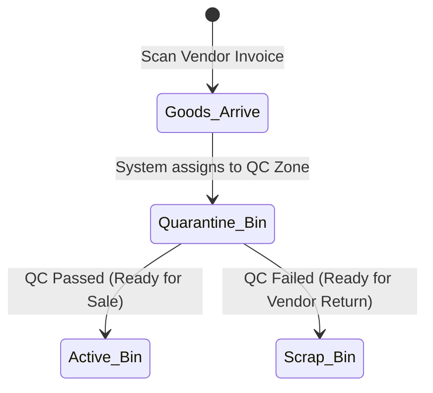
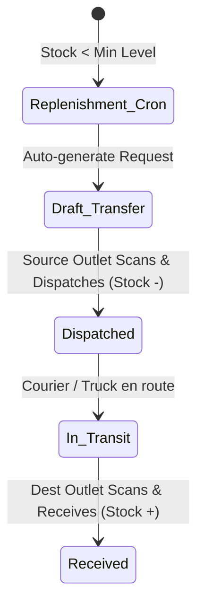

# 🏭 Spec: Enterprise Advanced Inventory & WMS (V2)
**Module:** `04_inventory_and_wms`  
**Phase:** Phase 4 (Advanced Warehouse Operations)  
**Architecture:** Single Company, Multi-Branch (Non-Tenancy)
**Status:** In Progress / Target Architecture  
**Document Standard:** Spec-Driven Development (SDD) Specification

---

## 1. Business Objective & Context
To transform the inventory system into a world-class, audit-compliant Enterprise Warehouse Management System (WMS) operating across multiple physical outlets/warehouses under a single corporate entity.

### Core Upgrades (New Enterprise Features):
1. **Micro-Location (Bin) Management:** Track inventory not just at the `Outlet` level, but precisely down to the `WarehouseZone` and `WarehouseBin` (Rack/Shelf).
2. **Barcode & Scanner Integration:** Fast GRN receiving and Delivery dispatch using USB/Handheld scanners and auto-generated system Barcodes/QR codes.
3. **FIFO Stock Batches & Costing Engine:** Track every receipt as an isolated lot/batch with its exact `unit_landed_cost`. Cost is depleted in sequential FIFO order.
4. **Multi-Stage Stock Transfers:** Outlet-to-outlet stock movements with strict 3-stage flow: `Draft ➔ In-Transit ➔ Received`.
5. **Quality Control (QC) & Quarantine:** Goods received are placed in quarantine/inspection states before entering active bins.
6. **Auto-Replenishment Engine:** Scheduled checks against `min_stock_level` to auto-generate Draft POs.
7. **Month-End Snapshots:** Frozen monthly closing valuations for auditing.

---

## 2. Database Schema & Invariants

```text
SCHEMA INVARIANTS (Upgraded):

├── outlets (Warehouses / Branches)
│   ├── warehouse_zones (e.g., Electronics, Garments, Quarantine)
│   │   ├── id (PK), outlet_id (FK), name, type ('active', 'quarantine', 'scrap')
│   │   └── warehouse_bins (e.g., Rack A-1, Shelf 3)
│   │       └── id (PK), zone_id (FK), name, barcode (for location scanning)
│
├── products & product_variants
│   └── (Drop vendor_id, Drop qty). Ensure 'barcode' column exists and is unique.
│
├── product_vendors (Master Data Pivot)
│   └── id (PK), product_id (FK), vendor_id (FK), purchase_price, lead_time_days
│
├── inventory_stocks (Physical Location Stock - Upgraded)
│   ├── id (PK), outlet_id (FK), bin_id (nullable FK), product_id (FK), variant_id (nullable FK), quantity (decimal:12,4)
│   └── Invariant: Unique constraint on (outlet_id, bin_id, product_id, variant_id). Quantity >= 0.
│
├── stock_batches (FIFO / LIFO Lot Engine)
│   ├── id (PK), batch_no, barcode (Unique QR/Barcode for this specific lot), outlet_id (FK), product_id (FK), 
│   │   received_qty, remaining_qty, unit_landed_cost, received_date, status ('quarantine','active','depleted')
│   └── Invariant: remaining_qty >= 0.
│
├── stock_transfers & items (3-Stage Transfer Lifecycle)
│   ├── status ('draft','pending_approval','dispatched','in_transit','received','cancelled')
│
├── stock_ledgers (Permanent Immutable Audit Log)
│   ├── id (PK), outlet_id (FK), product_id (FK), batch_id (nullable FK),
│   │   reference_type ('opening','purchase_grn','delivery_order','transfer_out','transfer_in','adjustment'),
│   │   in_qty, out_qty, balance_qty, unit_cost, date
│   └── Invariant: StockLedger records are NEVER updated or deleted.
│
└── month_end_snapshots
    └── id (PK), snapshot_date, outlet_id, product_id, total_quantity, fifo_valuation_amount
```

---

## 3. Workflow State Machines

### A. Advanced Receiving (GRN) & Quarantine Flow


### B. 3-Stage Transfer & Replenishment Flow


---

## 4. Security & Concurrency Invariants
1. **Barcode Uniqueness:** System-generated barcodes for batches must be cryptographically unique to prevent scanning collisions.
2. **Atomic Depletion:** FIFO depletion must use `SELECT ... FOR UPDATE` to lock batch rows during simultaneous scanner hits from multiple cashiers/packers.
3. **Bin Constraints:** Stock cannot be negative in any specific `warehouse_bin`.
