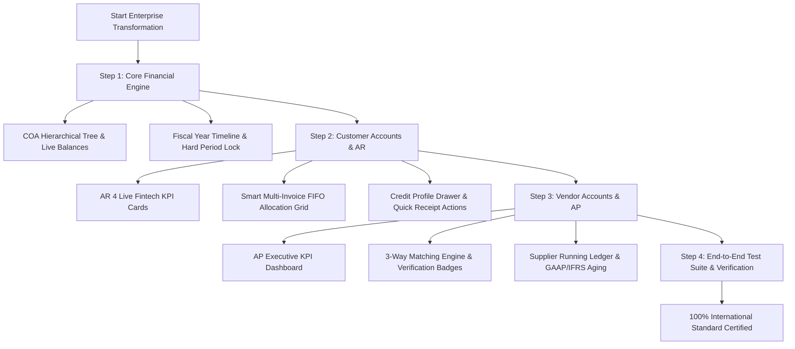

# 🏛️ Enterprise Accounts & Financial Management — Master Architecture Plan
**Module:** `05_financial_accounting`  
**Standard:** SAP S/4HANA Finance & Odoo 17 Enterprise Architecture  
**Target Quality:** 100% International Enterprise Level  
**Document Version:** 1.0 (Master Execution Plan)  
**Created:** September 1, 2026  

---

## 📌 1. Executive Objective & Overview

To transform the entire **Accounts Module** of B2B Viking ERP into an **international, enterprise-grade accounting and financial suite** matching the functionality, reliability, and UX aesthetics of **SAP S/4HANA Finance, Odoo 17 Enterprise, and Oracle NetSuite**.

This master plan governs the sequential transformation across **3 Core Pillars**:
1. 🏢 **Pillar 1: Core Financial Engine** *(General Ledger, Chart of Accounts Tree & Fiscal Periods)*
2. 👥 **Pillar 2: Accounts Receivable (AR)** *(Commercial Invoices, Smart Multi-Invoice Allocation & AR Aging)*
3. 🏭 **Pillar 3: Accounts Payable (AP)** *(Vendor Bills, 3-Way Matching, Payment Vouchers & AP Aging)*

---

## 🏛️ 2. The 3 Enterprise Pillars & Detailed Specifications

```
┌────────────────────────────────────────────────────────────────────────────────────────┐
│               ENTERPRISE FINANCIAL ACCOUNTING ECOSYSTEM (SAP & ODOO)                   │
├───────────────────────────────┬────────────────────────────────────────────────────────┤
│ Pillar 1: General Ledger (GL) │ Master Data, Chart of Accounts Tree & Fiscal Lock      │
│ Pillar 2: Accounts Receivable │ Sales Invoices, Multi-Invoice FIFO Allocation & Aging  │
│ Pillar 3: Accounts Payable    │ 3-Way Matching Engine, Vendor Bills & AP Aging Matrix  │
└───────────────────────────────┴────────────────────────────────────────────────────────┘
```

---

### 🏢 Pillar 1: Core Financial Engine (General Ledger & Governance)
*(SAP: **FI-GL** | Odoo: **Configuration & General Ledger**)*

#### 1.1 Chart of Accounts (COA) Tree View & Live Balances (SAP `FS00`)
- **Structure:** 5-Tier GAAP/IFRS account classification (Assets 1000s, Liabilities 2000s, Equity 3000s, Revenue 4000s, Expenses 5000s).
- **UI/UX Transformation:**
  - Collapsible Folder Tree View (Expand/Collapse `[+]` group headers).
  - Real-time Running Debit/Credit Balance badges next to each account head calculated directly from General Ledger lines.
  - System Account Protection badges (`🔒 System Account`) preventing deletion/code tampering of core 1010, 1020, 1030, 1050, 2010, 2020, 4010, 5010 heads.
  - 1-Click Export to Excel/CSV with account hierarchy and opening balances.

#### 1.2 Fiscal Years & Closed Period Lock Manager (SAP `OB52`)
- **Structure:** `fiscal_years` table with `is_closed`, `closed_at`, `closed_by`.
- **UI/UX Transformation:**
  - Interactive Fiscal Year Progress Timeline (Days remaining in current active FY).
  - Hard Posting Lock Enforcement: Immediate rejection of any voucher/invoice dated within a closed fiscal period.
  - Lock/Re-open action modal with multi-factor confirmation and audit logging.

---

### 👥 Pillar 2: Accounts Receivable (AR) — Customer Accounting
*(SAP: **FI-AR** | Odoo: **Invoicing & Customer Payments**)*

#### 2.1 Live Executive AR Dashboard (Fintech KPI Cards)
- **Top 4 KPI Metrics:**
  1. 💰 **Total AR Outstanding (DKK):** Total unpaid receivables across all customers.
  2. 🟢 **Collected This Month (DKK):** Total customer payments cleared in current month.
  3. 🔴 **Critical Overdue (>30 Days DKK):** High-risk overdue invoices requiring immediate collection.
  4. 🔵 **Unallocated Customer Advance (DKK):** On-account deposits waiting for invoice allocation.

#### 2.2 Smart Multi-Invoice FIFO Allocation Grid (SAP `F-28` / Odoo `Register Payment`)
- **Workflow:**
  - Selecting a Customer dynamically fetches and displays **ALL open/unpaid Sales Invoices** in an interactive allocation matrix table.
  - **"Auto-Allocate" (FIFO Button):** Single click automatically applies a lump-sum amount (e.g. 50,000 DKK) across older unpaid invoices sequentially until depleted.
  - **Manual Allocation Override:** Accountant can custom allocate specific amounts per invoice row.
  - **Overpayment & Advance Handling:** Excess payment amounts are clearly displayed and converted into Customer Credit / Advance.

#### 2.3 Customer Credit Profile & Instant Slide-out Drawer
- Real-time side drawer displaying customer credit limit, current credit exposure, payment history, and aging breakdown without leaving the screen.
- 1-Click Digital Payment Receipt modal preview, direct PDF print, and WhatsApp/Email delivery trigger.

---

### 🏭 Pillar 3: Accounts Payable (AP) — Vendor Accounting
*(SAP: **FI-AP** | Odoo: **Vendor Bills & Supplier Payments**)*

#### 3.1 Live Executive AP Dashboard Cards
- **Top 4 KPI Metrics:**
  1. 💳 **Total AP Payable (DKK):** Total vendor debt across all suppliers.
  2. ⏳ **Due in Next 7 Days (DKK):** Upcoming cash outflow obligations.
  3. ⚠️ **Overdue AP (DKK):** Overdue vendor bills incurring supplier risk.
  4. 📝 **Unapplied Debit Notes (DKK):** Vendor return credits available for deduction.

#### 3.2 3-Way Matching Engine (SAP `MIRO` / Odoo `3-Way Match`)
- **Audit Verification Invariants:**
  - **PO vs GRN vs Vendor Bill:** Validates Purchase Order Ordered Qty & Agreed Price vs Goods Receipt Received Qty vs Vendor Bill Invoiced Qty & Price.
  - **Visual Status Badges:**
    - `3-Way Matched (Verified)` (Green badge)
    - `Qty Mismatch Warning` (Yellow badge)
    - `Price Variance Warning` (Red badge)
- **Automated Debit Note Settlement:** Allows 1-click deduction of pending vendor return credits against new bills.

#### 3.3 Supplier Ledger, AP Aging & Outgoing Payment Vouchers (SAP `F-53` / `FBL1N`)
- Chronological running statement of accounts with running net liability balance.
- AP Aging analysis strictly calculated on **Payment Due Dates (`due_date`)** across 0-30, 31-60, 61-90, 90+ days.
- Bank Account Live Balance helper showing current liquidity before releasing vendor payment vouchers.

---

## 🗂️ 3. Exact Code & File Modification Matrix

```
┌────────────────────────────────────────────────────────────────────────────────────────┐
│                           AFFECTED FILES & CODE DIRECTORY                              │
├───────────────────────────────┬────────────────────────────────────────────────────────┤
│ Layer                         │ Target Files                                           │
├───────────────────────────────┼────────────────────────────────────────────────────────┤
│ Controllers                   │ ChartOfAccountController.php                           │
│                               │ FiscalYearController.php                               │
│                               │ CustomerPaymentController.php                          │
│                               │ SalesInvoiceController.php                             │
│                               │ VendorBillController.php                               │
│                               │ PurchasePaymentController.php                          │
│                               │ VendorLedgerController.php                             │
├───────────────────────────────┼────────────────────────────────────────────────────────┤
│ Services                      │ JournalEntryService.php                                │
│                               │ CustomerPaymentService.php                             │
│                               │ SalesInvoiceService.php                                │
│                               │ VendorBillService.php                                  │
│                               │ VendorPaymentService.php                               │
│                               │ VendorLedgerService.php                                │
├───────────────────────────────┼────────────────────────────────────────────────────────┤
│ Blade Views                   │ resources/views/backend/accounts/chart_of_accounts/*   │
│                               │ resources/views/backend/accounts/fiscal_years/*        │
│                               │ resources/views/backend/customer_payments/*            │
│                               │ resources/views/backend/sales_invoices/*               │
│                               │ resources/views/backend/accounts/due_orders.blade.php  │
│                               │ resources/views/backend/vendor_bills/*                 │
│                               │ resources/views/backend/purchase_payment/*             │
│                               │ resources/views/backend/vendor_ledger/*                │
│                               │ resources/views/backend/layouts/navbar.blade.php       │
├───────────────────────────────┼────────────────────────────────────────────────────────┤
│ Tests                         │ tests/Feature/Accounting/*                             │
└───────────────────────────────┴────────────────────────────────────────────────────────┘
```

---

## 🚀 4. Sequential Step-by-Step Implementation Roadmap



### 📋 Phase Checklist:

#### ✅ Step 1: Core Financial Engine (COA & Fiscal Years)
- [ ] Upgrade `ChartOfAccountController` with running GL balance calculations.
- [ ] Implement interactive tree view in `chart_of_accounts/index.blade.php`.
- [ ] Add system account security badges and Excel hierarchy export.
- [ ] Upgrade `fiscal_years/index.blade.php` with visual active timeline and lock manager.

#### ✅ Step 2: Customer Accounts & AR (Receivables)
- [ ] Add 4 real-time KPI metrics in `CustomerPaymentController@index`.
- [ ] Build Multi-Invoice Allocation logic in `CustomerPaymentService`.
- [ ] Modernize `customer_payments/create.blade.php` with smart dynamic matrix grid and FIFO auto-allocate.
- [ ] Polish `customer_payments/index.blade.php` with KPI cards and quick receipt preview.
- [ ] Verify `due_orders.blade.php` pre-fill integrations.

#### ✅ Step 3: Vendor Accounts & AP (Payables)
- [ ] Add 4 AP Executive KPI metrics in `VendorBillController@index`.
- [ ] Build 3-Way Match Verification helper in `VendorBillService`.
- [ ] Modernize `vendor_bills/index.blade.php` with 3-Way Match badges and AP KPI widgets.
- [ ] Upgrade `vendor_ledger/index.blade.php` and `aging.blade.php` with interactive running balance and due date buckets.

#### ✅ Step 4: Verification & Automated Integration Tests
- [ ] Run full automated test suite `php artisan test --filter=Accounting`.
- [ ] Ensure 100% assertions pass with zero double postings and zero regression.

---

## 🔒 5. Invariants & Zero-Risk Guarantees
1. **Zero Database Data Loss:** All existing charts, balances, orders, and payments remain preserved and intact.
2. **Strict Dual-Entry Invariant:** Every GL transaction maintains $\sum \text{Debit} == \sum \text{Credit}$.
3. **Enterprise Idempotency:** Guaranteed single journal entry posting per business transaction.
