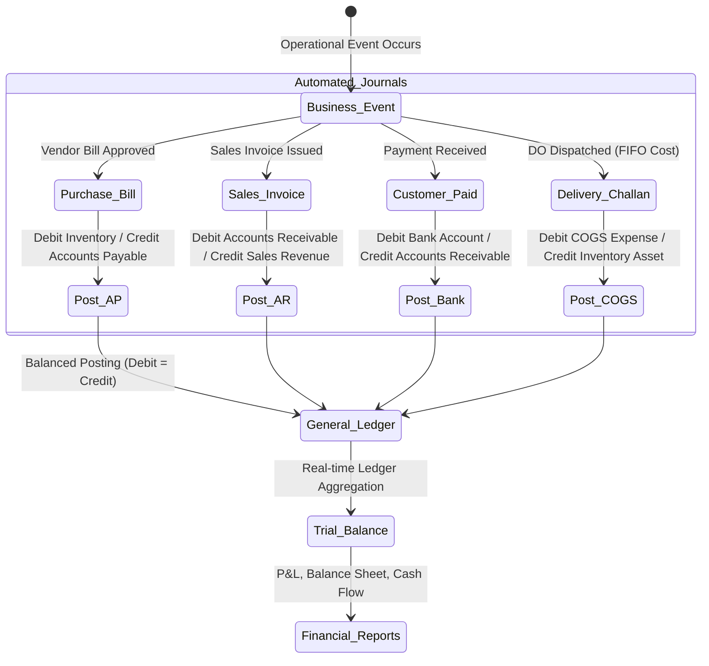

# 📈 Spec: Financial Accounting & General Ledger
**Module:** `05_financial_accounting`  
**Phase:** Phase 5 (Core Financial Accounting)  
**Status:** Planned / Target Architecture  
**Document Standard:** Spec-Driven Development (SDD) Specification

---

## 1. Business Objective & Context
To provide an automated, IFRS-compliant double-entry accounting backbone for Copenhagen Tourist Point (b2bviking.com):
1. **Chart of Accounts (COA Tree):** Hierarchical ledger accounts across Assets (1000s), Liabilities (2000s), Equity (3000s), Income (4000s), and Expenses (5000s).
2. **Automated Journal Engine (Observers):** Zero-manual data entry — purchases, sales invoices, payments, and stock adjustments automatically post balanced debit/credit journal entries.
3. **Banking & Petty Cash:** Multi-bank tracking, petty cash registers, fund transfers, and auto-matching bank statement reconciliation.
4. **Fixed Asset Lifecycle:** Asset capitalization, automated monthly straight-line depreciation, and disposal accounting.
5. **Real-time Financial Statements:** Trial Balance, Profit & Loss (Income Statement), Balance Sheet, and Aged Receivables/Payables.

---

## 2. Database Schema & Invariants

```text
SCHEMA INVARIANTS:
├── chart_of_accounts (COA Nested Tree)
│   ├── id (PK), code (e.g. 1010, 1020, 4010, 5010), name, type ('asset','liability','equity','income','expense'),
│   │   parent_id (nullable self-FK), is_reconcilable (bool), status ('active','inactive')
│   └── Invariant: Code must be unique. Primary head accounts cannot be deleted.
│
├── fiscal_years
│   ├── id (PK), name (e.g. 'FY 2026-2027'), start_date, end_date, is_closed (bool), closed_at
│   └── Invariant: Exactly one active fiscal year open for current date.
│
├── journal_entries & journal_entry_lines
│   ├── journal_entries: id (PK), entry_no (JV-YYYYMM-XXXX), date, reference_type (Order, Purchase, Payment, etc.),
│   │   reference_id, description, status ('draft','posted','reversed')
│   └── journal_entry_lines: id (PK), journal_entry_id (FK), account_id (FK -> chart_of_accounts),
│       debit_amount (decimal), credit_amount (decimal), description, party_type, party_id
│   └── Invariant: SUM(debit_amount) MUST EQUAL SUM(credit_amount) [Zero-Imbalance Rule].
│
├── bank_accounts & bank_transactions
│   ├── bank_accounts: id (PK), bank_name, account_name, account_number, currency_id (FK), opening_balance, current_balance
│   └── bank_transactions: bank_account_id, transaction_date, reference, type ('deposit','withdrawal'), amount, status ('unmatched','matched','cleared')
│
├── bank_reconciliations
│   ├── id (PK), bank_account_id (FK), statement_date, statement_balance, ledger_balance, difference, status ('in_progress','reconciled')
│
├── petty_cash_transactions & fund_transfers
│   ├── petty_cash: id, outlet_id, date, amount, transaction_type ('in','out'), receipt_no, approved_by
│   └── fund_transfers: id, from_account_id, to_account_id, amount, transfer_date, reference
│
└── assets & asset_depreciations
    ├── assets: id, asset_code, name, purchase_date, purchase_cost, salvage_value, useful_life_years, current_value, status
    └── asset_depreciations: asset_id, depreciation_date, depreciation_amount, accumulated_depreciation, journal_entry_id
```

---

## 3. Double-Entry Flow State Machine



---

## 4. Key Accounting Posting Rulebook

| Business Event | Debit Account | Credit Account |
| :--- | :--- | :--- |
| **Goods Receipt (GRN)** | `1050 Inventory in Warehouse` | `2020 GRN Accrued Clearing` |
| **Vendor Bill Matched** | `2020 GRN Accrued Clearing` | `2010 Accounts Payable (Vendor)` |
| **Vendor Paid via Bank**| `2010 Accounts Payable (Vendor)` | `1020 Bank Account` |
| **Delivery Order (FIFO)**| `5010 Cost of Goods Sold (COGS)`| `1050 Inventory in Warehouse` |
| **Sales Invoice Issued** | `1030 Accounts Receivable (Client)` | `4010 Wholesale Sales Revenue` |
| **Customer Payment (Bank)**| `1020 Bank Account` | `1030 Accounts Receivable (Client)` |
| **Monthly Depreciation**| `5080 Depreciation Expense` | `1090 Accumulated Depreciation` |

---

## 5. Security & Invariant Rules

1. **Zero-Imbalance Invariant:** A database transaction cannot commit any `journal_entry` unless $\sum \text{Debits} == \sum \text{Credits}$.
2. **Posted Entry Immutability:** Once a journal entry is marked `posted`, it cannot be modified or deleted. Adjustments must be performed via reversing entries (`reversal_of_id`).
3. **Closed Fiscal Year Lock:** No entries can be posted to dates falling inside a closed fiscal year.

---

## 6. Acceptance Criteria & Test Scenarios

- [ ] **AC-01:** Creating a Vendor Bill for 5,000 DKK auto-posts Balanced Journal Entry (DR Inventory 5,000 / CR Accounts Payable 5,000).
- [ ] **AC-02:** Confirming Customer Payment of 12,000 DKK auto-posts Balanced Journal Entry (DR Bank 12,000 / CR Accounts Receivable 12,000) and updates Bank Account current balance.
- [ ] **AC-03:** Profit & Loss Statement accurately calculates `Net Profit = Total Revenue - Total COGS - Operating Expenses`.
- [ ] **AC-04:** Balance Sheet equation holds true at all times: $\text{Total Assets} = \text{Total Liabilities} + \text{Total Equity}$.
