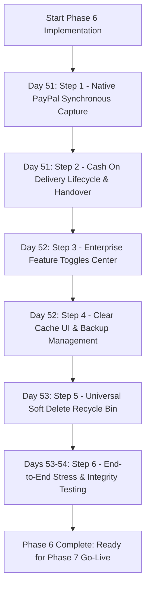

# 🛡️ Enterprise Payments, System Controls, Utilities & QA — Master Architecture Plan
**Module:** `06_payments_settings_and_testing`  
**Standard:** SAP S/4HANA & Odoo 17 Enterprise Systems Architecture  
**Hosting Environment:** Namecheap Shared Hosting (cPanel / Apache / PHP-FPM)  
**Target Quality:** 100% International Enterprise Level  
**Document Version:** 2.0 (Shared-Hosting Optimized Plan)  
**Created:** September 8, 2026  

---

## 📌 1. Executive Objective & Overview

With the successful completion of **Phase 5 (Core Financial Accounting & General Ledger)**, B2B Viking ERP possesses an IFRS-compliant double-entry accounting foundation. 

**Phase 6** governs the critical operational hardening of the ERP system tailored specifically for **Namecheap Shared Hosting**. This phase delivers:

1. 💳 **Pillar 1: Payment Gateways (Strictly PayPal & Cash On Delivery - COD | Shared Hosting Optimized)**
   - **Native Direct PayPal Express Capture:** Built with Laravel's built-in `Http` client (`Illuminate\Support\Facades\Http`). Zero third-party package dependencies (zero package version conflicts on Laravel 12).
   - **Direct Synchronous Return URL Capture (No Webhook Engine):** Completely bypasses asynchronous Webhooks to prevent Namecheap cPanel ModSecurity firewall blocks, SSL handshake drops, and dead queue worker failures. Captures payments synchronously on return (`/paypal/success`), settling invoices and auto-posting double-entry GL entries (DR 1020 / CR 1030) in real time.
   - **Cash On Delivery (COD) Operational Lifecycle:** Complete order-to-cash workflow for physical delivery challans, driver cash collection, cashier reconciliation, and petty cash drawer deposit (Account 1010).
   - **Explicit Rule:** NO third-party gateway distractions (Stripe, Klarna, MobilePay, Adyen). Exclusively PayPal and COD.

2. 🎛️ **Pillar 2: Enterprise Feature Toggles & System Control Center**
   - Single administrative dashboard (`Admin ➔ Settings ➔ Feature Toggles`) to turn automations ON/OFF dynamically (Auto-Replenish, Vendor Emails, Quote Reminders, Credit Limit Locks, Auto-Journals, PayPal, COD) without code deployments.

3. 🧹 **Pillar 3: System Utilities & Maintenance Suite**
   - 1-Click Clear Cache UI (Application, Route, Config, View, OPcache) accessible from the web panel.
   - Enterprise Backup & Recovery Center powered by `spatie/laravel-backup` with secure downloads and retention management.
   - Universal Soft Delete Recycle Bin with relation verification and foreign-key safe permanent deletion.

4. 🧪 **Pillar 4: System-wide End-to-End QA & Stress Verification Suite**
   - Multi-layer automated testing validating GL zero-imbalance, FIFO inventory depletion consistency, and multi-level approval race condition safety.

---

## 🏛️ 2. The 4 Enterprise Pillars & Detailed Specifications

```
┌────────────────────────────────────────────────────────────────────────────────────────┐
│             PHASE 6: ENTERPRISE CONTROLS, PAYMENTS & SYSTEM HARDENING                  │
├───────────────────────────────┬────────────────────────────────────────────────────────┤
│ Pillar 1: Payment Gateways    │ Strictly PayPal Express (Synchronous) & COD Lifecycle  │
│ Pillar 2: Feature Toggles     │ Master Automation Switches with In-Memory Caching      │
│ Pillar 3: System Maintenance  │ Clear Cache UI, Spatie Backup Manager, Recycle Bin     │
│ Pillar 4: System-Wide QA      │ GL Zero-Imbalance, FIFO Stress & Concurrency Audits    │
└───────────────────────────────┴────────────────────────────────────────────────────────┘
```

---

### 💳 Pillar 1: Payment Gateways (PayPal & Cash On Delivery - COD Only)
*(SAP: **FI-CA / Payment Engine** | Odoo: **Payment Providers & Cash Register**)*

#### 1.1 Dedicated Navbar Navigation Module (`Payment Gateways`)
Located directly below **Accounts** and above **Brands / Enterprise Setup** in `resources/views/backend/layouts/navbar.blade.php`:
```html
💳 Payment Gateways (Main Sidebar Header)
  ├── ⚙️ Gateway Settings (Route: admin.payments.gateways - Tab 1: COD | Tab 2: PayPal)
  ├── 💵 COD Collections (Route: admin.payments.cod.index - Driver Runs & Cashier Handover)
  └── 🧾 Transactions (Route: admin.payments.transactions.index - Audit Log of All Payments)
```

#### 1.2 Gateway Settings Interactive Tabbed UI/UX (`/admin/payments/gateways`)
- **Top KPI Banners:**
  1. 💵 **COD Status:** Active/Inactive badge, Max order limit indicator.
  2. 🅿️ **PayPal Status:** Active/Inactive, Sandbox/Live badge, live API health indicator.
  3. 💰 **Total PayPal Collected (DKK):** Total settled through PayPal direct captures.
  4. 🤝 **Total COD Handed Over (DKK):** Physical cash deposited into Account `1010`.
- **Interactive Dual Tabs:**
  - 🟢 **Tab 1: Cash On Delivery (COD / Kontant ved levering)**
    - Master Switch: Enable / Disable COD.
    - Max Order Amount Limit (e.g. kr. 10,000 max).
    - Default Cash Drawer GL Head: Account `1010 Petty Cash / Cash in Hand`.
    - Delivery Driver & Dispatch Notes.
  - 🔵 **Tab 2: PayPal Express Checkout**
    - Master Switch: Enable / Disable PayPal.
    - Environment Mode: `Sandbox` vs `Live`.
    - Client ID & Client Secret (Show/Hide toggle, encrypted storage).
    - Currency Code (`DKK` default, `EUR`, `USD`).
    - ⚡ **"Test PayPal Connection" Action Button:** Real-time ping to PayPal OAuth2 API with instant toast & success indicator.
    - Auto-generated Return & Cancel URLs display box.

#### 1.3 PayPal REST API v2 Direct Synchronous Capture (Native Code, No Webhook)
- **Workflow:**
  - Client-side PayPal button or Express Checkout redirect on Checkout / Invoice Pay screens.
  - Server-side endpoint generates PayPal v2 Order via Native `Http::withToken()` with currency `DKK` (or `EUR`/`USD`), invoice reference, and `return_url` = `route('admin.paypal.success')`.
  - Customer authorizes payment on PayPal.
  - PayPal redirects the browser back to your site: `GET /admin/paypal/success?token=ORDER_ID`.
  - The controller synchronously captures the funds via direct API call: `POST /v2/checkout/orders/{token}/capture`.
  - Upon receiving `status: COMPLETED`:
    - Dispatches to `CustomerPaymentService@recordPayment`:
      - Knocks down `SalesInvoice` and `Order` due balances.
      - Posts balanced GL Journal: **DR 1020 Bank Account / CR 1030 Accounts Receivable**.
    - Idempotency guard: Prevents duplicate journal entries on browser refresh.
    - Displays instant paid invoice receipt.

#### 1.4 Cash On Delivery (COD) Operational & Cashier Lifecycle
- **Status Progression:**
  1. `pending_dispatch`: Order confirmed with payment method = `cod`.
  2. `out_for_delivery`: Assigned to Delivery Driver / Courier with physical delivery challan.
  3. `collected`: Driver delivers goods and collects physical currency notes.
  4. `handed_over`: Driver deposits physical cash envelope to Company Cashier.
  5. `settled`: Cashier verifies cash count, posts payment to Account `1010 (Petty Cash / Cash in Hand)`, and marks invoice `paid`.
- **Driver / Cashier Mobile-Friendly Interface:**
  - Fast receipting interface with barcode scanning and quick discrepancy notes.

---

### 🎛️ Pillar 2: Enterprise Feature Toggles & System Control Center
*(SAP: **SPRO / Feature Flags** | Odoo: **Settings Configuration**)*

#### 2.1 Centralized Toggle Inventory
Located under `Admin ➔ Settings ➔ Feature Toggles`:

| Module | Toggle Key | Default | Description |
| :--- | :--- | :---: | :--- |
| **Payments** | `payment_paypal_enabled` | `ON` | Enable/Disable PayPal Express Checkout for customers. |
| **Payments** | `payment_paypal_sandbox` | `ON` | Toggle between PayPal Sandbox and Live Production mode. |
| **Payments** | `payment_cod_enabled` | `ON` | Allow customers to select Cash On Delivery at checkout. |
| **Inventory** | `inventory_auto_replenish` | `OFF` | Nightly 01:00 AM cron generating draft POs for low stock. |
| **Inventory** | `inventory_month_end_snapshot` | `ON` | Automatic month-end frozen inventory valuation snapshots. |
| **Inventory** | `inventory_enforce_bins` | `OFF` | Enforce mandatory bin selection during GRN & dispatch. |
| **Procurement** | `procurement_require_cs_matrix` | `ON` | Mandatory 3-quote CS comparison before PO creation. |
| **Procurement** | `procurement_auto_landed_cost` | `ON` | Auto-allocate custom duty & freight to batch costs. |
| **Sales** | `sales_strict_credit_lock` | `ON` | Block sales orders exceeding customer credit limit. |
| **Sales** | `sales_multi_level_approval` | `ON` | Route high-value sales orders through approval matrix. |
| **Accounting** | `accounts_auto_post_invoices` | `ON` | Auto-post balanced GL journals upon invoice confirmation. |
| **Accounting** | `accounts_lock_closed_periods` | `ON` | Hard lock prohibiting entries inside closed fiscal periods. |
| **Notifications** | `mail_auto_po_to_vendor` | `OFF` | Auto-email PO PDF to vendor upon management approval. |
| **Notifications** | `mail_quote_expiry_reminders` | `ON` | Daily cron sending quotation expiry reminders. |

#### 2.2 Microsecond Performance Architecture
- Zero database load: evaluated via static request cache and 24-hour application cache tag (`Cache::remember('system_feature_toggles')`).
- Helper function `is_feature_enabled(string $key, bool $default = true): bool`.

---

### 🧹 Pillar 3: System Utilities & Maintenance Suite
*(SAP: **Basis Administration** | Odoo: **Technical Settings**)*

#### 3.1 Clear Cache Optimization UI (`Admin ➔ Settings ➔ Clear Cache`)
- Visual dashboard showing server cache status:
  - Application Data Cache (Redis / File)
  - Route URL Cache
  - Config Array Cache
  - Blade Compiled Views Cache
  - PHP Zend OPcache status (memory consumption, hit rate, reset trigger)
- 1-Click "Purge All & Warm Up" button with real-time execution timer feedback.

#### 3.2 Automated Backup & Recovery Center (`Admin ➔ Settings ➔ Backups`)
- Utilizes installed `spatie/laravel-backup` package.
- Actionable UI features:
  - "Generate Full Backup" (Database + Files)
  - "Generate Database Backup Only" (Fast SQL Dump)
  - Backup history table (Filename, Size in MB, Storage Disk, Creation Date, Age)
  - Secure Stream Download (Single-use signed URL, Super Admin only)
  - Prune / Delete expired backups.

#### 3.3 Universal Soft-Delete Recycle Bin (`Admin ➔ System ➔ Recycle Bin`)
- Centralized recovery hub across all soft-deleted models:
  - Products, Customers, Vendors, Orders, Invoices, Purchase Orders, Quotations.
- Grid with tabs per model, showing:
  - Item Code / Name, Deleted Date, Trashed By User.
  - "Restore" action: Validates unique constraints before reinstating record.
  - "Permanent Delete" action: Runs integrity check (fails if record is tied to financial journal lines or stock ledger entries).

---

### 🧪 Pillar 4: System-wide End-to-End QA & Stress Verification Suite
*(SAP: **Audit & Reconciliation Workbench** | Odoo: **Automated Integrity Tests**)*

#### 4.1 Automated Integrity Test Suites
1. **General Ledger Zero-Imbalance Audit (`GeneralLedgerIntegrityTest`):**
   - Asserts $\sum \text{Debits} == \sum \text{Credits}$ across all journal entries in the database.
   - Verifies that no orphaned lines exist without a header.
2. **FIFO Stock Costing & Depletion Consistency (`FifoValuationStressTest`):**
   - Simulates 50 rapid sequential delivery orders against multi-batch inventory.
   - Validates that older batches are depleted first and unit landed cost reflects exact FIFO logic.
3. **Approval Workflow Concurrency & Lock Guard (`ApprovalWorkflowConcurrencyTest`):**
   - Simulates simultaneous approval requests to verify database locking prevents duplicate approval triggers.
4. **PayPal Synchronous Capture Idempotency (`PayPalSynchronousCaptureTest`):**
   - Simulates duplicate return URL execution and verifies that exactly 1 journal entry and 1 payment record are created.

---

## 🗂️ 3. Exact Code & File Modification Matrix

```
┌────────────────────────────────────────────────────────────────────────────────────────┐
│                           AFFECTED FILES & CODE DIRECTORY                              │
├───────────────────────────────┬────────────────────────────────────────────────────────┤
│ Layer                         │ Target Files                                           │
├───────────────────────────────┼────────────────────────────────────────────────────────┤
│ Migrations                    │ database/migrations/2026_09_08_000001_add_phase6_...   │
│                               │ - Add feature_toggles & paypal fields to general_settings│
│                               │ - Create payment_transactions table                    │
│                               │ - Create cod_collections table                         │
│                               │ - Create system_backup_logs table                      │
├───────────────────────────────┼────────────────────────────────────────────────────────┤
│ Models                        │ app/Models/PaymentTransaction.php                      │
│                               │ app/Models/CodCollection.php                           │
│                               │ app/Models/GeneralSetting.php (casts & helpers)        │
│                               │ app/Models/SystemBackupLog.php                         │
├───────────────────────────────┼────────────────────────────────────────────────────────┤
│ Services                      │ app/Services/Payment/PayPalService.php (Native Http)   │
│                               │ app/Services/Payment/CodService.php                    │
│                               │ app/Services/System/FeatureToggleService.php           │
│                               │ app/Services/System/BackupManagementService.php        │
│                               │ app/Services/System/RecycleBinService.php              │
├───────────────────────────────┼────────────────────────────────────────────────────────┤
│ Controllers                   │ app/Http/Controllers/Backend/PayPalPaymentController.php│
│                               │ app/Http/Controllers/Backend/PaymentSettingController.php│
│                               │ app/Http/Controllers/Backend/FeatureToggleController.php │
│                               │ app/Http/Controllers/Backend/MaintenanceController.php  │
│                               │ app/Http/Controllers/Backend/RecycleBinController.php   │
│                               │ app/Http/Controllers/Backend/CodManagementController.php│
├───────────────────────────────┼────────────────────────────────────────────────────────┤
│ Blade Views                   │ resources/views/backend/settings/feature_toggles.blade...│
│                               │ resources/views/backend/settings/payments.blade.php    │
│                               │ resources/views/backend/maintenance/clear_cache.blade...│
│                               │ resources/views/backend/maintenance/backups.blade.php  │
│                               │ resources/views/backend/system/recycle_bin.blade.php   │
│                               │ resources/views/backend/cod_collections/*              │
├───────────────────────────────┼────────────────────────────────────────────────────────┤
│ Helpers & Commands            │ app/Helpers/helpers.php (is_feature_enabled)           │
│                               │ app/Console/Commands/VerifySystemIntegrityCommand.php  │
├───────────────────────────────┼────────────────────────────────────────────────────────┤
│ Tests                         │ tests/Feature/Phase6/PayPalPaymentTest.php             │
│                               │ tests/Feature/Phase6/CodSettlementTest.php             │
│                               │ tests/Feature/Phase6/FeatureToggleTest.php             │
│                               │ tests/Feature/Phase6/SystemIntegrityTest.php           │
└───────────────────────────────┴────────────────────────────────────────────────────────┘
```

---

## 🚀 4. Sequential Step-by-Step Implementation Roadmap (Days 51 - 54)



### 📋 Phase 6 Detailed Checklists:

#### ✅ Step 1: Native PayPal Express Checkout & Direct Capture (Day 51)
- [ ] Create database tables for `payment_transactions`.
- [ ] Build `PayPalService` using native `Http::withBasicAuth` and `Http::withToken` (no extra packages).
- [ ] Implement `PayPalPaymentController` with `createOrder`, `success` (synchronous capture), and `cancel` routes.
- [ ] Connect direct capture to `CustomerPaymentService@recordPayment` for automatic double-entry GL posting (DR 1020 Bank / CR 1030 AR).
- [ ] Build PayPal configuration tab in `settings/payments.blade.php`.

#### ✅ Step 2: Cash On Delivery (COD) Lifecycle & Cash Handover (Day 51)
- [ ] Create database table `cod_collections`.
- [ ] Build `CodService` supporting driver collection acknowledgment and cashier handover.
- [ ] Add COD collection register UI under `Admin ➔ Sales ➔ COD Collections`.
- [ ] Wire cashier cash receipt to auto-post balanced journal (DR 1010 Petty Cash / CR 1030 AR).

#### ✅ Step 3: Enterprise Feature Toggles Center (Day 52)
- [ ] Add `feature_toggles` JSON column to `general_settings`.
- [ ] Implement `is_feature_enabled()` in `app/Helpers/helpers.php` with microsecond caching.
- [ ] Build `FeatureToggleController` and interactive UI with AJAX switches in `backend/settings/feature_toggles.blade.php`.
- [ ] Connect toggles to Auto-Replenish cron, email triggers, credit locks, and payment gateways.

#### ✅ Step 4: Maintenance Center: Clear Cache UI & Backups (Day 52)
- [ ] Build `MaintenanceController@clearCache` and interactive `backend/maintenance/clear_cache.blade.php`.
- [ ] Add OPcache status widget and one-click cache purge.
- [ ] Implement `BackupManagementService` utilizing `spatie/laravel-backup`.
- [ ] Build `backend/maintenance/backups.blade.php` with backup trigger, download, and delete actions.

#### ✅ Step 5: Universal Soft-Delete Recycle Bin (Day 53)
- [ ] Build `RecycleBinService` discovering trashed records across Products, Users, Vendors, Orders, Invoices, POs.
- [ ] Create `backend/system/recycle_bin.blade.php` with filtered model tabs.
- [ ] Implement safe restore and guarded permanent delete with financial foreign-key checks.

#### ✅ Step 6: System-wide End-to-End Stress & Integrity Test Suite (Days 53 - 54)
- [ ] Create `VerifySystemIntegrityCommand` (`php artisan system:verify-integrity`).
- [ ] Write PHPUnit tests for PayPal Synchronous Capture and COD cash settlement.
- [ ] Write PHPUnit tests for zero-imbalance accounting under high-concurrency order creation.
- [ ] Write FIFO inventory valuation stress tests.
- [ ] Execute full test suite and ensure 100% assertions pass.

---

## 🔒 5. Invariants & Zero-Risk Guarantees

1. **Zero Financial Discrepancy:** All online (PayPal) and physical (COD) transactions integrate strictly through `CustomerPaymentService` and `JournalEntryService`. Imbalanced journals are mathematically impossible.
2. **Double-Payment Protection:** Return URL capture idempotency locks guarantee that browser reloads will never double-credit customer balances.
3. **Audit Immutability:** Financial journals and inventory ledger rows can never be permanently deleted via the Recycle Bin. System integrity is guaranteed at the database level.
4. **Zero-Code Operation:** Business rules can be switched dynamically by administrators without touching codebase or configuration files.
5. **Namecheap Shared-Hosting Safety:** 100% free of webhooks, background queue worker dependencies, or package conflicts.
