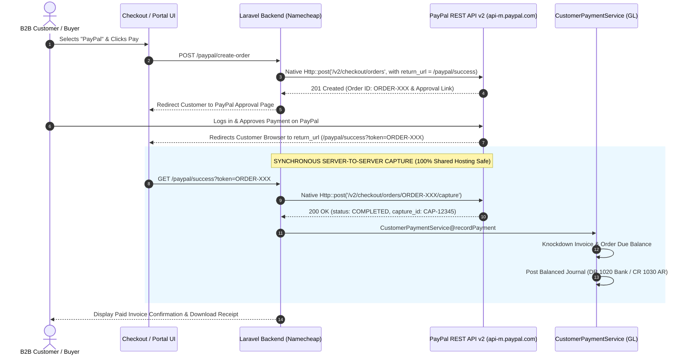
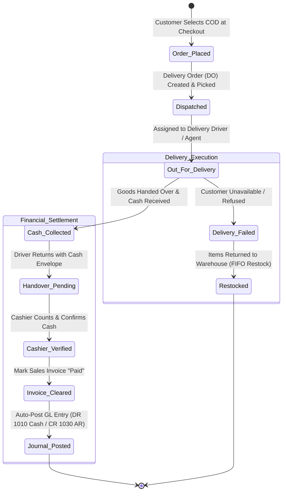

# 💳 Spec: Payments (PayPal & COD), System Controls, Utilities & QA
**Module:** `06_payments_settings_and_testing`  
**Phase:** Phase 6 (Payments, System Controls, Maintenance & End-to-End QA)  
**Hosting Environment:** Namecheap Shared Hosting (cPanel / Apache / PHP-FPM)  
**Status:** Planned / Target Architecture  
**Document Standard:** Spec-Driven Development (SDD) Specification

---

## 1. Business Objective & Context

To harden, secure, and prepare the Copenhagen Tourist Point ERP (b2bviking.com) for production go-live on **Namecheap Shared Hosting** across **4 Enterprise Pillars**:

1. **Payment Gateways (Strictly PayPal & Cash On Delivery - COD | Shared-Hosting Architecture):**
   - **Native Direct PayPal Express Capture (No Webhook Engine, No 3rd-Party Package):**
     - Built with **Laravel Native `Http` Client (`Illuminate\Support\Facades\Http`)** — zero extra vendor packages, eliminating package version conflicts on Laravel 12.
     - **Direct Synchronous Return URL Capture:** Completely bypasses asynchronous Webhooks. Avoids Namecheap cPanel ModSecurity firewall blocks, domain SSL callback failures, and dead queue worker issues. Funds are captured synchronously on customer return (`/paypal/success`), immediately marking the Sales Invoice as `paid` and posting balanced double-entry GL journal vouchers (DR 1020 Bank / CR 1030 AR).
   - **Cash On Delivery (COD / Kontant ved levering) Lifecycle:**
     - Order-to-cash workflow for physical deliveries. Driver/Courier cash collection receipting, cash-in-hand reconciliation, cashier petty cash drawer handover, and automated invoice clearance into Account 1010 (Petty Cash/Cash in Hand).
   - **Strict Constraint:** **ONLY PayPal and COD** are supported. No third-party gateway distractions (Stripe, Klarna, MobilePay, Adyen).

2. **Enterprise Feature Toggles Center:**
   - Unified administrative control panel (`Admin ➔ Settings ➔ Feature Toggles`) providing real-time runtime switches for all core business automations (Auto-Replenish cron, Vendor emails, Quotation expiry alerts, Strict credit locks, Auto-journals, PayPal gateway, COD gateway).
   - Zero-downtime, zero-code configuration changes stored in cache-backed system settings.

3. **System Utilities & Maintenance Center:**
   - **Clear Cache UI:** Interactive administrative dashboard to flush and warm application cache, route cache, config cache, view templates, and OPcache directly from cPanel web environment.
   - **Automated Backup & Recovery Manager:** Backed by `spatie/laravel-backup`, enabling Super Admins to generate database and storage zip backups on demand, inspect backup health/sizes, and securely download or prune historical archives.
   - **Universal Recycle Bin:** Centralized management of soft-deleted records across all major ERP models (Products, Customers, Vendors, Orders, Invoices, Purchase Orders, Quotations) with one-click restore and foreign-key safe permanent deletion.

4. **System-wide End-to-End Testing & Integrity Verification:**
   - Automated stress tests and integrity audits validating zero-imbalance accounting invariant ($\sum \text{Debit} == \sum \text{Credit}$), FIFO inventory valuation accuracy under heavy order loads, and multi-level approval race condition locks.

---

## 2. Database Schema & Invariants

```text
SCHEMA INVARIANTS:
├── payment_transactions
│   ├── id (PK), transaction_no (e.g. TXN-202609-0001), gateway ('paypal', 'cod'),
│   ├── order_id (FK -> orders), sales_invoice_id (FK -> sales_invoices, nullable),
│   ├── customer_id (FK -> users), amount (decimal 12,2), currency ('DKK', 'EUR', 'USD'),
│   ├── external_reference (PayPal Capture ID / Cash Receipt No),
│   ├── status ('pending', 'captured', 'failed', 'refunded', 'cancelled'),
│   ├── payload (json - raw API response from PayPal v2 capture),
│   ├── created_at, updated_at
│   └── Invariant: External capture reference must be unique. Duplicate capture calls return existing settled state.
│
├── cod_collections
│   ├── id (PK), transaction_id (FK -> payment_transactions), order_id (FK -> orders),
│   ├── sales_invoice_id (FK -> sales_invoices), driver_id / courier_name,
│   ├── expected_amount (decimal 12,2), collected_amount (decimal 12,2),
│   ├── difference_amount (decimal 12,2, default 0.00),
│   ├── status ('pending_dispatch', 'out_for_delivery', 'collected', 'handed_over', 'failed'),
│   ├── collected_at (timestamp, nullable),
│   ├── handed_over_to_user_id (FK -> users, cashier/accountant),
│   ├── deposit_account_id (FK -> chart_of_accounts, 1010 Petty Cash / Cash in Hand),
│   ├── handed_over_at (timestamp, nullable), notes (text, nullable)
│   └── Invariant: An invoice cannot be marked 'paid' until cash status reaches 'handed_over' or 'collected'.
│
├── general_settings (Upgraded Columns)
│   ├── feature_toggles (JSON, nullable) -> Dynamic key-value pairs
│   ├── paypal_enabled (bool, default true),
│   ├── paypal_mode ('sandbox', 'live', default 'sandbox'),
│   ├── paypal_client_id (string, nullable),
│   ├── paypal_client_secret (text, nullable - encrypted),
│   ├── cod_enabled (bool, default true),
│   ├── cod_max_limit (decimal 12,2, default 10000.00),
│   └── cod_instructions (text, nullable)
│
└── system_backup_logs
    ├── id (PK), file_name (string), disk (string, default 'local'),
    ├── file_path (string), file_size_bytes (bigint),
    ├── backup_type ('full', 'database_only', 'files_only'),
    ├── status ('successful', 'failed'), triggered_by (FK -> users),
    └── created_at, completed_at
```

---

## 3. Workflow State Machines & Architectural Flows

### 3.1 PayPal Synchronous Return URL Capture Flow (Shared-Hosting Architecture)



---

### 3.2 Cash On Delivery (COD) Operational & Financial Flow



---

## 4. Key Accounting Posting Rulebook for Phase 6

| Business Event | Payment Method | Debit Account | Credit Account | Narration / Notes |
| :--- | :---: | :--- | :--- | :--- |
| **PayPal Payment Captured** | PayPal | `1020 Bank Account / PayPal Clearing` | `1030 Accounts Receivable (Client)` | Settles outstanding Sales Invoice upon return capture. |
| **COD Cash Deposited to Till** | COD | `1010 Petty Cash / Cash in Hand` | `1030 Accounts Receivable (Client)` | Triggered when cashier acknowledges cash receipt from driver. |
| **COD Refusal / Return** | COD | `1050 Inventory in Warehouse` | `5010 Cost of Goods Sold (COGS)` | Restocks FIFO inventory batch and cancels pending invoice. |

---

## 5. Security & Invariant Rules for Shared Hosting

1. **Synchronous Idempotency Lock:** Before calling the capture endpoint, the controller checks `payment_transactions.external_reference`. If already captured, it displays the existing receipt to prevent double-capturing or double-posting journals on browser refreshes.
2. **Zero Outbound Token Leakage:** PayPal Client Secret is stored encrypted in `general_settings` or `.env` and is never exposed in frontend scripts or network tabs.
3. **Strict COD Cash Handover Invariant:** Drivers cannot directly mark an invoice as `paid`. An invoice remains `partial` or `pending_cod` until the cashier or accountant records the physical handover into Account `1010 (Petty Cash)`.
4. **Soft Delete Restoration Integrity:** Restoring a soft-deleted record (e.g. Sales Invoice) must verify that its dependent master relations (Customer, Fiscal Year, Chart of Accounts) are active and not archived. Permanent deletion is strictly forbidden if foreign key references exist in `journal_entry_lines`.
5. **Super Admin Guard on Maintenance Utilities:** Access to `Clear Cache`, `Download Backup`, and `Permanent Delete in Recycle Bin` requires explicit Super Admin role privileges (`admin` / `manage_system_settings`).

---

## 6. Acceptance Criteria & Test Scenarios

- [ ] **AC-01 (PayPal Direct Capture):** Customer clicks PayPal, approves sandbox payment, returns to `/paypal/success`, and funds capture synchronously. Invoice status becomes `paid`, and balanced journal posts (DR 1020 / CR 1030).
- [ ] **AC-02 (Browser Refresh Idempotency):** Refreshing the `/paypal/success` page does NOT trigger duplicate payment records or duplicate journal vouchers.
- [ ] **AC-03 (COD Full Flow):** An order placed with COD transitions through `dispatched` ➔ `cash_collected` ➔ `handed_over`. The cashier confirms cash receipt of kr. 4,500; the invoice marks `paid` and Account 1010 increments by kr. 4,500.
- [ ] **AC-04 (Feature Toggle Immediate Effect):** Toggling `inventory_auto_replenish` to `OFF` in the UI immediately prevents replenishment commands, verified without server restart.
- [ ] **AC-05 (Cache Clearing Verification):** Clicking "Clear Application Cache" flushes Redis/file cache, view cache, and route cache directly from the web panel, returning a success toast.
- [ ] **AC-06 (Backup Generation & Download):** Triggering manual backup creates a valid `.zip` archive containing the MySQL dump, downloadable directly from cPanel/browser.
- [ ] **AC-07 (Recycle Bin Restitution):** Trashing a test product moves it to Recycle Bin; clicking "Restore" reinstates it with SKU integrity intact.
- [ ] **AC-08 (System-wide Integrity Audit):** Running `php artisan system:verify-integrity` validates that $\sum \text{Debits} == \sum \text{Credits}$ across all journal entries with 0 discrepancy.
