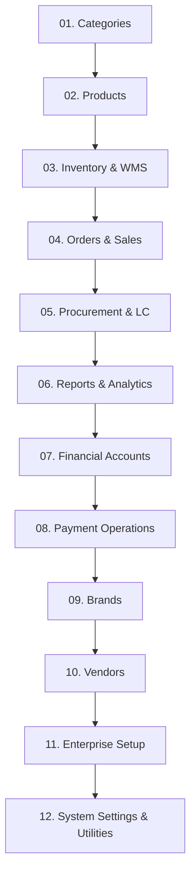

# 🏛️ Enterprise Controller Architecture & SDD Refactoring Blueprint
**System:** Copenhagen Tourist Point (b2bviking.com) — B2B Viking ERP  
**Standard:** Thin Controllers, Domain Service Layer, Isolated FormRequests, Async Queueable Jobs  
**Approach:** 12-Module Navbar Hierarchy Order (From Legacy Customer ERP to True Tier-1 Enterprise)  
**Status:** Official Architectural Specification (Living Documentation)

---

## 🎯 1. Architectural Vision & Rationale

As B2B Viking ERP evolved from a basic customer ecommerce shop into a multi-company, multi-currency international enterprise ERP, older legacy controllers (e.g. `CategoryController`, `ProductController`, `BrandController`, `VendorController`) accumulated technical debt:
- Inline `$request->validate()` and manual attribute assignment.
- Direct database writes without atomic `DB::transaction()` safety.
- Commented-out debugging code (e.g. `// dd($request->all())`) and unused `use` imports.
- Inconsistent AJAX response contracts (raw arrays vs `response()->json()`).
- Mixed error handling strategies causing 500 error screens on unexpected edge cases.

### The Target Enterprise SDD Standard:
Every single controller across the 12 Navbar sections will be refactored into a **Thin HTTP Orchestrator**:
1. **Zero Inline Validation:** 100% delegated to dedicated `FormRequest` classes in `app/Http/Requests/{Module}/`.
2. **Zero Raw Business Logic in Controllers:** 100% delegated to dedicated `Domain Service` classes in `app/Services/{Module}/`.
3. **Atomic Safety:** Multi-table mutations encapsulated within `DB::transaction()`.
4. **Asynchronous Decoupling:** Heavy I/O (Emails, PDF generation, audit broadcasts) dispatched via Queueable `Jobs` in `app/Jobs/`.
5. **Strict Typing:** PHP 8.2+ `declare(strict_types=1);`, strict parameter types, explicit return types (`View`, `RedirectResponse`, `JsonResponse`).
6. **Uniform Response Contracts:** Standardized JSON schemas and predictable Toastr flash alerts.

---

## 🗺️ 2. The 12-Module Navbar Execution Map

We execute strictly by the physical layout of the Admin Navigation Sidebar (`resources/views/backend/layouts/navbar.blade.php`):



---

### Module 01: Categories `[5/5 Completed]` ✅ `[Pragmatic Senior Thin SDD]`
- [x] **`CategoryController.php`** ✅ *(Completed & Verified)*
  - FormRequest: `CategoryCreateRequest`, `CategoryUpdateRequest`, `CategoryToggleStatusRequest`, `CategoryToggleFrontendShowRequest`
  - Pattern: Pragmatic Thin Controller *(Direct Eloquent + Cascading safety guard, Zero anemic service)*
  - Feature Test: `tests/Feature/Controllers/Category/CategoryControllerTest.php`
  - Test Verification: `10 passed (28 assertions)` via `php artisan test tests/Feature/Controllers/Category/CategoryControllerTest.php`
- [x] **`SubCategoryController.php`** ✅ *(Completed & Verified)*
  - FormRequest: `SubCategoryCreateRequest`, `SubCategoryUpdateRequest`, `SubCategoryToggleStatusRequest`
  - Pattern: Pragmatic Thin Controller *(Direct Eloquent + Child category safety guard, Zero anemic service)*
  - Feature Test: `tests/Feature/Controllers/Category/SubCategoryControllerTest.php`
  - Test Verification: `9 passed (28 assertions)` via `php artisan test tests/Feature/Controllers/Category/SubCategoryControllerTest.php`
- [x] **`ChildCategoryController.php`** ✅ *(Completed & Verified)*
  - FormRequest: `ChildCategoryCreateRequest`, `ChildCategoryUpdateRequest`, `ChildCategoryToggleStatusRequest`
  - Pattern: Pragmatic Thin Controller *(Direct Eloquent + Cascading AJAX lookups, Zero anemic service)*
  - Feature Test: `tests/Feature/Controllers/Category/ChildCategoryControllerTest.php`
  - Test Verification: `10 passed (31 assertions)` via `php artisan test tests/Feature/Controllers/Category/ChildCategoryControllerTest.php`
- [x] **`SliderController.php`** ✅ *(Completed & Verified)*
  - FormRequest: `SliderCreateRequest`, `SliderUpdateRequest`, `SliderToggleStatusRequest`
  - Pattern: Pragmatic Thin Controller *(Preserves ImageUploadTrait for banner upload/update/delete + Serial calculation, Zero anemic service)*
  - Feature Test: `tests/Feature/Controllers/Category/SliderControllerTest.php`
  - Test Verification: `8 passed (25 assertions)` via `php artisan test tests/Feature/Controllers/Category/SliderControllerTest.php`
- [x] **`ProductTypeController.php`** ✅ *(Completed & Verified)*
  - FormRequest: `ProductTypeCreateRequest`, `ProductTypeUpdateRequest`, `ProductTypeToggleStatusRequest`
  - Pattern: Pragmatic Thin Controller *(Direct Eloquent + Product association guard, Zero anemic service)*
  - Feature Test: `tests/Feature/Controllers/Category/ProductTypeControllerTest.php`
  - Test Verification: `8 passed (22 assertions)` via `php artisan test tests/Feature/Controllers/Category/ProductTypeControllerTest.php`

---

### Module 02: Products & Attributes `[0/4 Completed]`
- [ ] **`ProductController.php`** `[Tier A: Service-Backed]`
  - FormRequest: `ProductStoreRequest`, `ProductUpdateRequest`
  - Domain Service: `ProductMasterService` (variant matrix generation, barcode/SKU creation, gallery storage, pricing multipliers)
  - Feature Test: `tests/Feature/Controllers/Products/ProductControllerTest.php`
- [ ] **`UnitController.php`** `[Tier B: Pragmatic Thin CRUD]`
  - FormRequest: `UnitStoreRequest`, `UnitUpdateRequest`, `UnitToggleStatusRequest`
  - Domain Service: *None (Pragmatic Thin CRUD — Eloquent in Controller)*
  - Feature Test: `tests/Feature/Controllers/Products/UnitControllerTest.php`
- [ ] **`ColorController.php`** `[Tier B: Pragmatic Thin CRUD]`
  - FormRequest: `ColorStoreRequest`, `ColorUpdateRequest`, `ColorToggleStatusRequest`
  - Domain Service: *None (Pragmatic Thin CRUD — Eloquent in Controller)*
  - Feature Test: `tests/Feature/Controllers/Products/ColorControllerTest.php`
- [ ] **`SizeController.php`** `[Tier B: Pragmatic Thin CRUD]`
  - FormRequest: `SizeStoreRequest`, `SizeUpdateRequest`, `SizeToggleStatusRequest`
  - Domain Service: *None (Pragmatic Thin CRUD — Eloquent in Controller)*
  - Feature Test: `tests/Feature/Controllers/Products/SizeControllerTest.php`

---

### Module 03: Inventory & Warehouse Management (WMS) `[0/8 Completed]`
- [ ] **`StockAdjustmentController.php`** `[Tier A: Service-Backed — StockAdjustmentService]`
- [ ] **`StockTransferController.php`** `[Tier A: Service-Backed — StockTransferService]`
- [ ] **`StockLedgerController.php`** `[Tier A: Service-Backed — StockLedgerService]`
- [ ] **`StockBatchController.php`** `[Tier A: Service-Backed — StockBatchService]`
- [ ] **`MonthEndSnapshotController.php`** `[Tier A: Service-Backed — MonthEndSnapshotService]`
- [ ] **`InventoryReportController.php`** `[Tier A: Service-Backed — InventoryQueryService]`
- [ ] **`WarehouseZoneController.php`** `[Tier B: Pragmatic Thin CRUD — Eloquent]`
- [ ] **`WarehouseBinController.php`** `[Tier B: Pragmatic Thin CRUD — Eloquent]`

---

### Module 04: Orders & Commercial Sales `[0/10 Completed]`
- [ ] **`SalesQuotationController.php`** `[Tier A: Service-Backed — SalesQuotationService]`
- [ ] **`SalesOrderController.php`** `[Tier A: Service-Backed — SalesOrderService]`
- [ ] **`OrderController.php`** `[Tier A: Service-Backed — OrderFulfillmentService]`
- [ ] **`DeliveryOrderController.php`** `[Tier A: Service-Backed — DeliveryOrderService]`
- [ ] **`SalesReturnController.php`** `[Tier A: Service-Backed — SalesReturnService]`
- [ ] **`CreditNoteController.php`** `[Tier A: Service-Backed — CreditNoteService]`
- [ ] **`CustomProductRequestController.php`** `[Tier A: Service-Backed — CustomProductRequestService]`
- [ ] **`PricelistController.php`** `[Tier A: Service-Backed — PricelistService]`
- [ ] **`CouponController.php`** `[Tier B: Pragmatic Thin CRUD — Eloquent]`
- [ ] **`GiftCardController.php`** `[Tier A: Service-Backed — GiftCardService]`

---

### Module 05: Procurement & International Supply Chain `[0/7 Completed]`
- [ ] **`RfqController.php`** `[Tier A: Service-Backed — RfqService]`
- [ ] **`PurchaseOrderController.php`** `[Tier A: Service-Backed — PurchaseOrderService]`
- [ ] **`VendorBillController.php`** `[Tier A: Service-Backed — VendorBillService]`
- [ ] **`LetterOfCreditController.php`** `[Tier A: Service-Backed — LetterOfCreditService / LandedCostService]`
- [ ] **`ShipmentController.php`** `[Tier A: Service-Backed — ShipmentTrackingService]`
- [ ] **`GoodsReceiptController.php`** `[Tier A: Service-Backed — GoodsReceiptService]`
- [ ] **`VendorReturnController.php`** `[Tier A: Service-Backed — VendorReturnService]`

---

### Module 06: Reports & Analytics `[0/3 Completed]`
- [ ] **`ReportController.php`** `[Tier A: Service-Backed — AnalyticsQueryService]`
- [ ] **`PurchaseReportController.php`** `[Tier A: Service-Backed — PurchaseReportService]`
- [ ] **`VendorLedgerController.php`** `[Tier A: Service-Backed — VendorLedgerReportService]`

---

### Module 07: Financial Accounting & General Ledger `[0/11 Completed]`
- [ ] **`JournalVoucherController.php`** `[Tier A: Service-Backed — JournalPostingService]`
- [ ] **`SalesInvoiceController.php`** `[Tier A: Service-Backed — SalesInvoiceService]`
- [ ] **`CustomerPaymentController.php`** `[Tier A: Service-Backed — CustomerPaymentService]`
- [ ] **`PurchasePaymentController.php`** `[Tier A: Service-Backed — PurchasePaymentService]`
- [ ] **`BankReconciliationController.php`** `[Tier A: Service-Backed — BankReconciliationService]`
- [ ] **`FundTransferController.php`** `[Tier A: Service-Backed — FundTransferService]`
- [ ] **`PettyCashController.php`** `[Tier A: Service-Backed — PettyCashService]`
- [ ] **`FixedAssetController.php`** `[Tier A: Service-Backed — FixedAssetService]`
- [ ] **`ChartOfAccountController.php`** `[Tier B: Pragmatic Thin CRUD — Eloquent]`
- [ ] **`FiscalYearController.php`** `[Tier B: Pragmatic Thin CRUD — Eloquent]`
- [ ] **`BankAccountController.php`** `[Tier B: Pragmatic Thin CRUD — Eloquent]`

---

### Module 08: Payment Operations `[0/2 Completed]`
- [ ] **`CodController.php`** `[Tier A: Service-Backed — CodSettlementService]`
- [ ] **`PaymentTransactionController.php`** `[Tier A: Service-Backed — PaymentGatewayService]`

---

### Module 09: Brands `[0/1 Completed]`
- [ ] **`BrandController.php`** `[Tier B: Pragmatic Thin CRUD — Eloquent + Logo Trait]`
  - FormRequest: `BrandStoreRequest`, `BrandUpdateRequest`
  - Domain Service: *None (Pragmatic Thin CRUD)*
  - Feature Test: `tests/Feature/Controllers/Brands/BrandControllerTest.php`

---

### Module 10: Vendors `[0/1 Completed]`
- [ ] **`VendorController.php`** `[Tier A: Service-Backed — VendorService (Opening balance & Ledger setup)]`
  - FormRequest: `VendorStoreRequest`, `VendorUpdateRequest`
  - Domain Service: `VendorService`
  - Feature Test: `tests/Feature/Controllers/Vendors/VendorControllerTest.php`

---

### Module 11: Enterprise Organization Setup `[0/6 Completed]`
- [ ] **`ApprovalWorkflowController.php`** `[Tier A: Service-Backed — ApprovalWorkflowService]`
- [ ] **`ApprovalController.php`** `[Tier A: Service-Backed — ApprovalService]`
- [ ] **`CompanyController.php`** `[Tier B: Pragmatic Thin CRUD — Eloquent]`
- [ ] **`OutletController.php`** `[Tier B: Pragmatic Thin CRUD — Eloquent]`
- [ ] **`DepartmentController.php`** `[Tier B: Pragmatic Thin CRUD — Eloquent]`
- [ ] **`CurrencyController.php`** `[Tier B: Pragmatic Thin CRUD — Eloquent]`

---

### Module 12: System Settings & Utilities `[0/11 Completed]`
- [ ] **`DocumentSequenceController.php`** `[Tier A: Service-Backed — DocumentSequenceService]`
- [ ] **`BackupController.php`** `[Tier A: Service-Backed — SystemBackupService]`
- [ ] **`RecycleBinController.php`** `[Tier A: Service-Backed — RecycleBinService]`
- [ ] **`UserController.php`** `[Tier A: Service-Backed — UserManagementService]`
- [ ] **`RoleController.php`** `[Tier A: Service-Backed — RolePermissionService]`
- [ ] **`PermissionController.php`** `[Tier B: Pragmatic Thin CRUD — Eloquent]`
- [ ] **`PricingRuleController.php`** `[Tier A: Service-Backed — PricingRuleService]`
- [ ] **`TaxController.php`** `[Tier B: Pragmatic Thin CRUD — Eloquent]`
- [ ] **`DiscountController.php`** `[Tier B: Pragmatic Thin CRUD — Eloquent]`
- [ ] **`SettingController.php`** `[Tier B: Pragmatic Thin CRUD — Eloquent]`
- [ ] **`PaymentSettingController.php`** `[Tier B: Pragmatic Thin CRUD — Eloquent]`

---

## 🧪 3. Mandatory Automated Feature Testing Architecture

To guarantee zero regressions and eliminate manual browser testing, **every refactored controller MUST be accompanied by a dedicated Feature Test in `tests/Feature/Controllers/{Module}/`**.

### Directory Structure:
```
tests/Feature/Controllers/
 ├── Category/
 │    ├── CategoryControllerTest.php
 │    ├── SubCategoryControllerTest.php
 │    ├── ChildCategoryControllerTest.php
 │    ├── SliderControllerTest.php
 │    └── ProductTypeControllerTest.php
 ├── Products/
 ├── Inventory/
 ├── Orders/
 ├── Procurement/
 ├── Reports/
 ├── Accounts/
 ├── Payments/
 ├── Brands/
 ├── Vendors/
 ├── EnterpriseSetup/
 └── System/
```

### Every Controller Test MUST Assert:
1. `index`: Renders view and validates DataTable response (`200 OK`).
2. `create`: Renders create view with required master data (`200 OK`).
3. `store`: Submits valid FormRequest payload, creates record (via Service+transaction for Tier A, direct Eloquent for Tier B), asserts DB state and redirect.
4. `store validation`: Submits invalid payload, asserts session has errors and 422/redirect.
5. `edit`: Renders edit view with correct model data (`200 OK`).
6. `update`: Submits updated payload, persists changes, asserts redirect and Toastr alert.
7. `destroy`: Deletes model, asserts DB missing, asserts JSON `{ status: 'success' }` (`200 OK`).
8. `destroy guards`: Attempts delete when active dependencies exist (e.g. subcategories under category), asserts deletion prevented and `{ status: 'error' }` with **HTTP `422`**.
9. `changeStatus / AJAX toggles`: Toggles boolean, asserts DB updated and JSON `{ status: 'success' }`.

---

## 📋 4. Definition of Done (DoD) per Controller

A controller is considered **100% SDD Refactored** ONLY when:
1. `declare(strict_types=1);` is declared at the top.
2. All methods have explicit parameter and return types (`View`, `RedirectResponse`, `JsonResponse`).
3. Zero inline `$request->validate()` — all input runs through dedicated `FormRequest`.
4. **Tier A (Service-Backed):** Zero raw database modifications in controller methods — all domain mutations live in a `Domain Service` wrapped in `DB::transaction()`. **Tier B (Pragmatic Thin CRUD):** Controller uses Eloquent directly (2–3 clean lines). No Service file required — do NOT create a pass-through service.
5. Zero dead code, no `dd()`, no `dump()`, and zero unused `use` imports.
6. All AJAX actions return standard `{ status: 'success'|'error', message: string, data?: mixed }` JSON. Business rule violations on `destroy` MUST return **HTTP `422`** (not `200`) with `{ status: 'error' }`. Success responses return **HTTP `200`**.
7. **Mandatory Passing Feature Test:** Dedicated test file in `tests/Feature/Controllers/{Module}/{Controller}Test.php` executed via `php artisan test tests/Feature/Controllers/{Module}/{Controller}Test.php` with **100% tests & assertions passed**.

