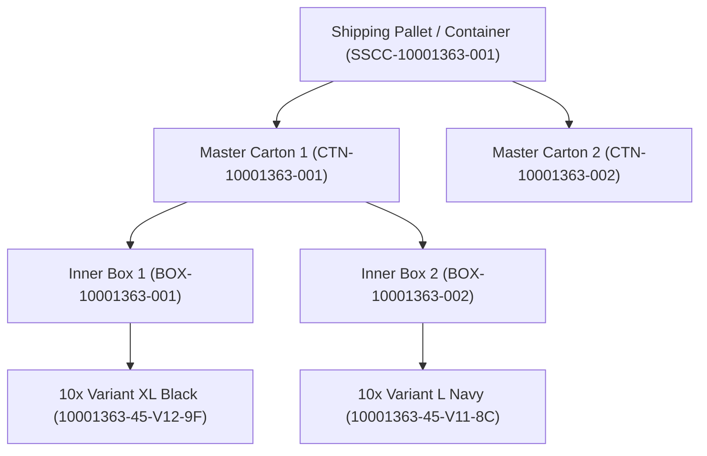

# 📦 Enterprise Architecture Plan: GS1 GPC Classification, Variant-Wise Barcoding & N-Tier Dynamic Packaging Hierarchy

**Module:** `10_barcode_and_label_printing`  
**Reference Document:** `/docs/10_barcode_and_label_printing/enterprise_gs1_and_packaging_hierarchy_plan.md`  
**Standard Compliance:** GS1 GPC Standard ([https://gpc-browser.gs1.org/](https://gpc-browser.gs1.org/)), GS1-128 / SSCC Logistics Standard, SAP EWM Handling Units (HU) & Oracle SCM Cloud  
**Target System:** B2B Viking ERP (Copenhagen Tourist Point — b2bviking.com)  
**Status:** Approved Architecture Plan  

---

## 1. 📌 Executive Summary & Architecture Goals

This document specifies the technical architecture to upgrade **B2B Viking ERP** from single-item retail barcoding into a **Tier-1 Global Enterprise Supply Chain & Warehouse Management System (WMS)**.

### Core Objectives:
1. **GS1 GPC Category Code Integration:** Embed internationally recognized 8-digit GS1 GPC Brick Codes into every barcode so warehouse staff, scanners, and customs instantly identify product category from the code itself.
2. **Variant-Wise Barcoding:** Every product variant (Color, Size, Material) has its own independent, collision-free, GPC-prefixed barcode.
3. **N-Tier Arbitrary Dynamic Packaging Hierarchy (Handling Units):** Zero hardcoded limitations. Admins can create 1-tier, 2-tier, 3-tier, 4-tier, or any N-tier nested packing tree (e.g. Item $\rightarrow$ Inner Box $\rightarrow$ Medium Carton $\rightarrow$ Master Case $\rightarrow$ Shipping Pallet/Container).
4. **Logistics Label Printing:** 4×6 inch (100×150mm) standard shipping carton and pallet labels conforming to GS1-128 / SSCC logistics standards.
5. **Bulk WMS Operations:** 1-scan container inward receiving and order dispatch without opening cartons or counting individual pieces.

---

## 2. 🌐 GS1 GPC (Global Product Classification) Category Integration

### 2.1 The GS1 GPC Standard
According to the [GS1 GPC Browser](https://gpc-browser.gs1.org/), products are globally classified into:
$$\text{Segment (2 digits)} \rightarrow \text{Family (2 digits)} \rightarrow \text{Class (2 digits)} \rightarrow \text{Brick (8 digits)}$$

### 2.2 Category Model Extension
In `categories` table:
* `gpc_code`: `VARCHAR(20)` (Indexed, e.g. `10001363` for T-Shirts, `10001452` for Mugs).
* `gpc_title`: `VARCHAR(255)` (Official GS1 Brick name).

### 2.3 Intelligent Barcode Structure

```text
┌─────────────────────────┬──────────────────────────────────────────┬────────────────────────────────────────────────────────┐
│ Level                   │ Barcode Format Formula                   │ Real-World Example                                     │
├─────────────────────────┼──────────────────────────────────────────┼────────────────────────────────────────────────────────┤
│ Product (Simple)        │ [GPC]-[PROD_ID]-[CHECKSUM]               │ 10001363-0045-8A                                       │
│ Product Variant         │ [GPC]-[PROD_ID]-V[VARIANT_ID]-[CHECKSUM] │ 10001363-0045-V12-9F (T-Shirt #45, Size XL, Color Blk) │
│ Inner Box (Small)       │ BOX-[GPC]-[SERIAL]                       │ BOX-10001363-2026-00104                                │
│ Master Carton (Medium)  │ CTN-[GPC]-[SERIAL]                       │ CTN-10001363-2026-00042                                │
│ Pallet / Container      │ SSCC-[GPC]-[18-DIGIT SERIAL]             │ SSCC-10001363-000008472910382910                       │
└─────────────────────────┴──────────────────────────────────────────┴────────────────────────────────────────────────────────┘
```

> **Visual Recognition Advantage:** Looking at the first 8 digits (`10001363`), any admin, warehouse worker, or scanner gun immediately knows the product is an Apparel/T-Shirt item.

---

## 3. 🏗️ N-Tier Arbitrary Dynamic Packaging Hierarchy (Handling Units)

### 3.1 Architectural Principles (Zero Limitation)
* **No Hardcoded Step Limits:** Businesses can use any packaging configuration:
  * **1-Tier:** Item $\rightarrow$ Master Carton
  * **2-Tier:** Item $\rightarrow$ Small Box $\rightarrow$ Master Carton
  * **3-Tier:** Item $\rightarrow$ Polybag Bundle $\rightarrow$ Inner Box $\rightarrow$ Master Carton
  * **4-Tier:** Item $\rightarrow$ Inner Box $\rightarrow$ Medium Carton $\rightarrow$ Master Carton $\rightarrow$ Pallet / Container
* **Recursive Parent-Child Handling Units:** Each physical box/carton/pallet is a `HandlingUnit` pointing to an optional `parent_handling_unit_id`.



---

## 4. 🗄️ Database Schema Specification

### 4.1 Table: `categories` (Modification)
| Column | Type | Nullable | Description |
|:---|:---|:---|:---|
| `gpc_code` | `VARCHAR(20)` | YES | Indexed GS1 GPC 8-digit Brick Code |
| `gpc_title` | `VARCHAR(255)` | YES | Human-readable GS1 classification |

### 4.2 Table: `packaging_types` (New)
Defines packaging vocabulary and hierarchy rank.
| Column | Type | Nullable | Description |
|:---|:---|:---|:---|
| `id` | `BIGINT UNSIGNED` | NO | Primary Key |
| `name` | `VARCHAR(100)` | NO | e.g. "Small Inner Box", "Master Carton", "Euro Pallet" |
| `code` | `VARCHAR(20)` | NO | e.g. `BOX`, `CTN`, `PLT`, `CNT` |
| `level_order` | `INT` | NO | Hierarchy rank (1 = inner, 10 = top shipping container) |
| `default_capacity` | `INT` | YES | Default item count capacity |
| `status` | `TINYINT(1)` | NO | Active = 1, Inactive = 0 |
| `created_at` / `updated_at` | `TIMESTAMP` | NO | Standard Laravel timestamps |

### 4.3 Table: `product_packagings` (New)
Configures standard packaging rules per product/variant.
| Column | Type | Nullable | Description |
|:---|:---|:---|:---|
| `id` | `BIGINT UNSIGNED` | NO | Primary Key |
| `product_id` | `BIGINT UNSIGNED` | NO | FK to `products.id` |
| `variant_id` | `BIGINT UNSIGNED` | YES | FK to `product_variants.id` (null = all variants) |
| `packaging_type_id` | `BIGINT UNSIGNED` | NO | FK to `packaging_types.id` |
| `parent_packaging_type_id` | `BIGINT UNSIGNED` | YES | FK to `packaging_types.id` (nesting rule) |
| `units_per_pack` | `INT` | NO | e.g. 10 pcs per Inner Box |
| `barcode` | `VARCHAR(100)` | YES | Pre-assigned trade barcode |

### 4.4 Table: `handling_units` (New)
Represents physical packed instances of boxes, cartons, and containers.
| Column | Type | Nullable | Description |
|:---|:---|:---|:---|
| `id` | `BIGINT UNSIGNED` | NO | Primary Key |
| `hu_code` | `VARCHAR(100)` | NO | Unique Barcode (e.g. `CTN-10001363-2026-00042`) |
| `packaging_type_id` | `BIGINT UNSIGNED` | NO | FK to `packaging_types.id` |
| `parent_handling_unit_id` | `BIGINT UNSIGNED` | YES | Self-FK to `handling_units.id` (nested parent) |
| `gpc_code` | `VARCHAR(20)` | YES | GS1 GPC Category Code |
| `status` | `ENUM` | NO | `open`, `packed`, `sealed`, `shipped`, `delivered`, `unpacked` |
| `total_quantity` | `INT` | NO | Aggregate count of all enclosed units |
| `net_weight_kg` | `DECIMAL(8,3)` | YES | Weight of enclosed products |
| `gross_weight_kg` | `DECIMAL(8,3)` | YES | Total weight including carton box |
| `warehouse_id` | `BIGINT UNSIGNED` | YES | Current WMS location |
| `warehouse_zone_id` | `BIGINT UNSIGNED` | YES | WMS Zone location |
| `warehouse_bin_id` | `BIGINT UNSIGNED` | YES | WMS Bin/Shelf location |
| `created_by` | `BIGINT UNSIGNED` | NO | FK to `users.id` |
| `created_at` / `updated_at` | `TIMESTAMP` | NO | Standard Laravel timestamps |

### 4.5 Table: `handling_unit_items` (New)
Items and quantities stored directly inside a specific Handling Unit.
| Column | Type | Nullable | Description |
|:---|:---|:---|:---|
| `id` | `BIGINT UNSIGNED` | NO | Primary Key |
| `handling_unit_id` | `BIGINT UNSIGNED` | NO | FK to `handling_units.id` |
| `product_id` | `BIGINT UNSIGNED` | NO | FK to `products.id` |
| `variant_id` | `BIGINT UNSIGNED` | YES | FK to `product_variants.id` |
| `quantity` | `INT` | NO | Pack count |
| `batch_no` | `VARCHAR(100)` | YES | Batch/Lot reference |
| `created_at` / `updated_at` | `TIMESTAMP` | NO | Standard Laravel timestamps |

---

## 5. 🖥️ User Experience & Studio Workflows

### 5.1 Variant-Wise Studio Workflow
1. **Search & Pick:** Search by keyword, SKU, or filter by category.
2. **Variant Matrix Drawer:** Expand any parent product to select individual sizes/colors (e.g. 50x XL Black, 30x L Navy).
3. **On-Demand Variant Barcode Generation:** Generate individual or bulk variant barcodes incorporating the Category GPC prefix.
4. **Thermal / Laser Sheet Printing:** Print individual 50×30mm or 38×25mm variant hangtags with Size, Color, Price, and Barcode.

### 5.2 Carton & Packaging Studio Workflow (`/admin/barcode-labels/cartons`)
1. **Select Packed Items:** Select products/variants from active order or inventory (e.g. 500 pcs T-Shirt XL).
2. **Define Packaging Level:**
   * Select Packaging Type: `Master Carton`.
   * Pack Capacity: 50 pcs per carton $\rightarrow$ System automatically computes **10 Cartons**.
   * Optional Nesting: Assign Cartons to a `Shipping Pallet`.
3. **Generate Handling Units:** System creates 10 Handling Units (`CTN-10001363-2026-00001` to `CTN-10001363-2026-00010`) and links them.
4. **Print 4×6 Inch Logistics Labels:**
   * Big, bold Code-128 / GS1-128 Barcode.
   * Clear GS1 Category Code and Title.
   * Product name and Variant breakdown table.
   * Quantity in Box (`50 Pcs`) and Carton Sequence (`Box 1 of 10`).
   * Gross & Net Weight.

---

## 6. ⚡ WMS Scan-to-Receive & Scan-to-Ship Operations

1. **1-Scan Bulk Receiving (Inward):**
   * Scan container barcode `SSCC-10001363-001` with scanner gun.
   * System instantly queries the Handling Unit tree and increments inventory stock for all 1,000 enclosed items in 1 second.
2. **Wholesale Dispatch (Outward):**
   * Scan master carton barcode `CTN-10001363-001`.
   * System verifies contents against customer order, marks the Handling Unit as `shipped`, and deducts 50 units from stock.
3. **Break-Bulk / Unpack:**
   * When breaking open a carton for retail display, scanning `Unpack` dissolves the container and moves items into loose shelf stock.

---

## 7. 🚀 Implementation Roadmap

### Phase 1: GS1 GPC Category Standard & Category Management
* Migration: Add `gpc_code` and `gpc_title` to `categories`.
* Seed standard GS1 GPC codes for existing Viking ERP categories (Apparel, Mugs, Souvenirs, Bags, Umbrellas).
* Update Category admin forms to configure and edit GPC codes.

### Phase 2: Variant-Wise Barcode Generation Engine
* Update `BarcodeLabelService` to resolve barcodes with formula: `[GPC]-[PROD_ID]-V[VARIANT_ID]-[HASH]`.
* Add individual and matrix variant barcode generation endpoints.
* Enhance Barcode Studio UI for variant-level queue and print actions.

### Phase 3: Packaging Types & Product Packaging Rules
* Create migration for `packaging_types` and `product_packagings`.
* Admin CRUD for packaging types (`BOX`, `CTN`, `PLT`, `CNT`).
* Product packaging specification setup in product edit screen.

### Phase 4: Carton & Container Packaging Studio
* Create migration for `handling_units` and `handling_unit_items`.
* Build Carton Packaging Studio screen (`/admin/barcode-labels/cartons`).
* Implement 4×6 inch (100×150mm) standard logistics shipping label template.

### Phase 5: WMS Scanner Integration
* Implement `/admin/wms/scan-handling-unit` endpoint for bulk scan receiving, transfer, and shipping.
* Provide "Unpack / Break-Bulk" handler.

---

## 8. 🧪 Verification & Automated Testing Plan

* `test_category_stores_gs1_gpc_code_and_generates_standard_product_barcode()`
* `test_variant_barcode_incorporates_gpc_and_variant_id()`
* `test_admin_can_define_arbitrary_n_tier_packaging_types()`
* `test_packaging_session_creates_nested_handling_units()`
* `test_carton_barcode_print_renders_4x6_shipping_label_with_manifest()`
* `test_scanning_parent_handling_unit_resolves_all_nested_children_and_items()`
