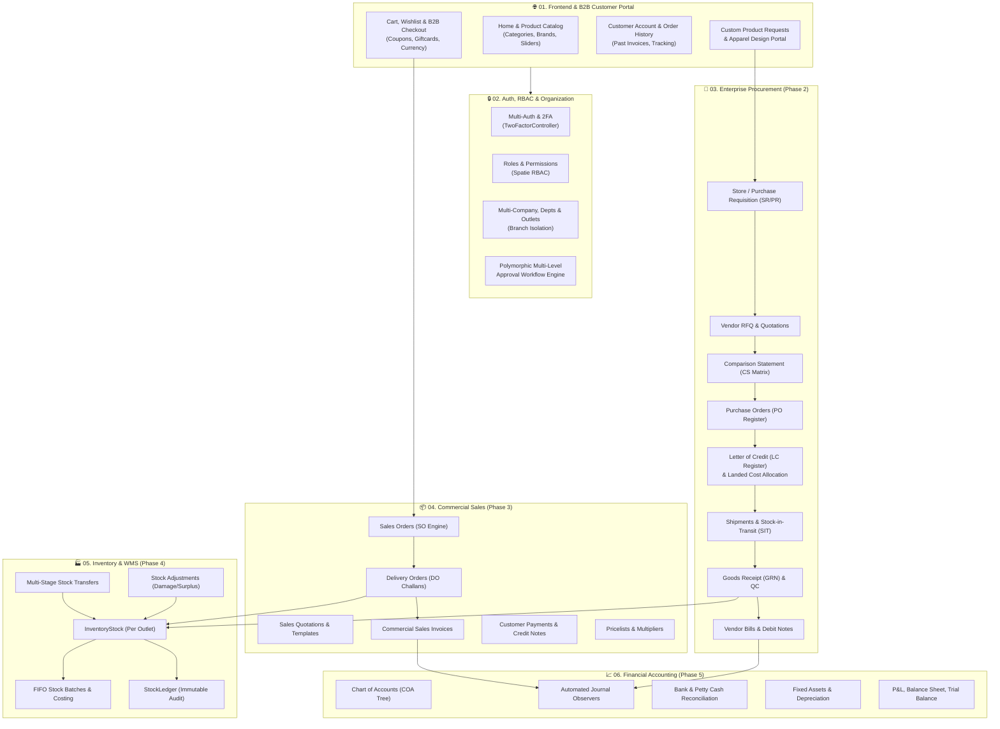

# 🗺️ B2B Viking ERP — Master 360° System Architecture & Full Codebase Map
**Target Platform:** Copenhagen Tourist Point ([b2bviking.com](https://b2bviking.com))  
**Architectural Standard:** Full-Stack Enterprise Laravel Spec-Driven System  
**Status:** Living Documentation (100% Complete Project Blueprint)  
**Last Updated:** August 2026

---

## 🏛️ 1. Complete System 360° Architecture Overview

The system unifies a **B2B E-Commerce & Retail Frontend Portal** with a **Tier-1 Enterprise ERP Backbone** (Multi-Company, Import Procurement, Commercial Sales, WMS Inventory, and Financial Accounting).

---

## 🌐 2. Complete Frontend & B2B E-Commerce Layer

The customer-facing portal allows retail customers, franchise outlets, and B2B corporate buyers to interact with the catalog:

| Frontend Controller | File Path | User Capabilities & Workflows |
| :--- | :--- | :--- |
| **`HomeController`** | `app/Http/Controllers/Frontend/HomeController.php` | Landing page, hero sliders, category navigation, brand showcase, multi-currency switcher, search. |
| **`AuthController`** | `app/Http/Controllers/Frontend/AuthController.php` | Customer & B2B Outlet registration, login, email verification, 2FA verification. |
| **`AccountController`** | `app/Http/Controllers/Frontend/AccountController.php` | Customer dashboard, profile settings, order history, invoice download, delivery status tracking. |
| **`CartController`** | `app/Http/Controllers/Frontend/CartController.php` | Add to cart, variant selection (Color, Size), mini-cart AJAX, quantity update, stock availability check. |
| **`WishlistController`** | `app/Http/Controllers/Frontend/WishlistController.php` | Save favorites, move to cart, remove from wishlist. |
| **`OrderController`** | `app/Http/Controllers/Frontend/OrderController.php` | Multi-step B2B Checkout, shipping address, coupon discount, gift card redemption, order creation (`Order`). |
| **`ProductRequestController`**| `app/Http/Controllers/Frontend/ProductRequestController.php` | Frontend B2B custom product requests, customized corporate apparel requirements, design uploads. |

---

## 🔒 3. Authentication, Security & Master Administration

| System Component | Key Files & Services | Core Responsibilities |
| :--- | :--- | :--- |
| **Authentication** | `app/Http/Controllers/Auth/*` | Session management, password reset, email verification, two-factor authentication (`TwoFactorController`). |
| **RBAC Security** | `UserController`, `RolesController`, `PermissionController` | Spatie Role-Based Access Control (`Admin`, `Manager`, `Warehouse`, `Accounts`, `Outlet User`). |
| **General Settings** | `SettingController`, `SliderController`, `TaxController` | Site configuration, logo/favicon, SMTP mail server setup, currency icons, tax categories, sliders. |
| **Document Sequences**| `DocumentSequenceController`, `OrderNumberService` | Atomic sequential document numbering (`SO-YYYYMMDD-XXXX`, `DO-YYYYMMDD-XXXX`, `GRN-YYYYMMDD-XXXX`). |

---

## 🏢 4. Master Data & Catalog Infrastructure

| Master Data Domain | Key Models & Controllers | Database Tables |
| :--- | :--- | :--- |
| **Product Hierarchy** | `CategoryController`, `SubCategoryController`, `ChildCategoryController` | `categories`, `sub_categories`, `child_categories` |
| **Product Attributes** | `BrandController`, `UnitController`, `ColorController`, `SizeController`, `ProductTypeController` | `brands`, `units`, `colors`, `sizes`, `product_types` |
| **Product Master** | `ProductController`, `Product`, `ProductVariant` | `products`, `product_variants`, `pricing_rules` |
| **Discounts & Loyalty**| `DiscountController`, `CouponController`, `GiftCardController` | `discounts`, `coupons`, `gift_cards`, `gift_card_transactions` |
| **Multi-Company** | `CompanyController`, `DepartmentController`, `OutletController`, `CurrencyController` | `companies`, `departments`, `outlets`, `currencies` |

---

## 🛒 5. Procurement & International Import Supply Chain (Phase 2)

| Stage | Business Function | Key Controllers & Services | Database Tables |
| :--- | :--- | :--- | :--- |
| **1. Requisition** | Store / Purchase Requisition (SR/PR) | `ProductRequestController`, `ApprovalService` | `product_requests`, `product_request_items` |
| **2. Sourcing** | RFQ & Vendor Quotation Ingestion | `RfqController`, `VendorQuotationController`, `RfqService` | `rfqs`, `rfq_items`, `rfq_vendors`, `vendor_quotations`, `vendor_quotation_items` |
| **3. Evaluation** | Comparison Statement (CS Matrix) | `ComparisonStatementController` | `comparison_statements`, `comparison_statement_items` |
| **4. PO Issue** | Purchase Order Generation & Email | `PurchaseOrderController`, `Purchase` | `purchases`, `purchase_details`, `proforma_invoices`, `po_email_logs` |
| **5. Import LC** | Letter of Credit & Cost Allocation | `LetterOfCreditController`, `LandedCostController`, `LandedCostService` | `letters_of_credit`, `lc_expenses`, `lc_amendments`, `landed_cost_allocations` |
| **6. Logistics** | Shipment Tracking & SIT | `ShipmentController` | `shipments`, `shipment_cost_estimates` |
| **7. Receiving** | Goods Receipt Note (GRN) & QC | `GoodsReceiptController`, `StockReceiveService` | `goods_receipts`, `goods_receipt_items` |
| **8. AP Billing** | Vendor Bills & Supplier Ledgers | `VendorBillController`, `VendorReturnController`, `VendorLedgerService` | `vendor_bills`, `vendor_bill_items`, `vendor_returns`, `vendor_return_items`, `party_ledgers` |

---

## 📦 6. Sales, Delivery Challan & Commercial Fulfillment (Phase 3)

| Stage | Business Function | Key Controllers & Services | Database Tables |
| :--- | :--- | :--- | :--- |
| **1. Quotations** | Sales Quotations & Reusable Templates | `SalesQuotationController`, `QuotationTemplate` | `sales_quotations`, `sales_quotation_items`, `quotation_templates` |
| **2. Pricing** | Dynamic Customer Pricelists | `PricelistController`, `PricelistResolverService`, `PricingRuleController` | `pricelists`, `pricelist_items`, `pricing_rules` |
| **3. Orders** | Sales Orders (SO) & Approval | `SalesOrderController`, `OrderApprovalController`, `CreditValidationService` | `orders`, `order_items`, `order_sequences` |
| **4. Fulfillment**| Delivery Orders (DO Challan) | `DeliveryOrderController`, `DeliveryOrder` | `delivery_orders`, `delivery_order_items` |
| **5. Invoicing** | Commercial Sales Invoices | `SalesInvoiceController`, `SalesInvoice` | `sales_invoices`, `sales_invoice_items` |
| **6. Payments** | Customer Payments & Settlements | `CustomerPaymentController`, `PaymentAllocation` | `customer_payments`, `payment_allocations`, `order_payments` |
| **7. Returns** | Sales Returns & Credit Notes | `SalesReturnController`, `CreditNoteController` | `sales_returns`, `sales_return_items`, `credit_notes` |

---

## 🏭 7. Inventory & Warehouse Management Engine (Phase 4)

| Component | Responsibility | Models & Services | Tables Involved |
| :--- | :--- | :--- | :--- |
| **Current Stock** | Physical stock per outlet & variant | `InventoryStock` | `inventory_stocks` |
| **Audit Ledger** | Immutable audit trail of all transactions | `StockLedger`, `StockLedgerController` | `stock_ledgers` |
| **FIFO Batches** | Batch-level costing, depletion & margin | `stock_batches` (FIFO Engine) | `stock_batches` |
| **Stock Transfer**| 3-stage outlet transfer (`Draft` ➔ `Dispatched` ➔ `Received`) | `StockTransferController`, `StockTransferService` | `stock_transfers`, `stock_transfer_items` |
| **Stock Adjust** | Damage, surplus, shrinkage write-offs | `StockAdjustmentController`, `StockAdjustmentService` | `stock_adjustments`, `stock_adjustment_items` |
| **Snapshots** | Frozen monthly inventory position & audit | `MonthEndSnapshot` | `month_end_snapshots`, `stock_counts`, `stock_count_lines` |

---

## 📈 8. Financial Accounting & General Ledger (Phase 5)

| Sub-Module | Responsibility | Models & Controllers | Tables Involved |
| :--- | :--- | :--- | :--- |
| **COA Tree** | Chart of Accounts nested hierarchy | `ChartOfAccount`, `AccountController` | `chart_of_accounts`, `fiscal_years` |
| **Auto-Journals**| Automatic observer debit/credit postings | `JournalEntry`, `JournalEntryLine` | `journal_entries`, `journal_entry_lines` |
| **Banking** | Multi-bank accounts & bank statement reconciliation | `BankAccount`, `BankTransaction`, `BankReconciliation` | `bank_accounts`, `bank_transactions`, `bank_reconciliations` |
| **Petty Cash** | Cash book & fund transfers | `PettyCashTransaction`, `FundTransfer` | `petty_cash_transactions`, `fund_transfers` |
| **Fixed Assets** | Asset registry & monthly straight-line depreciation | `Asset`, `AssetDepreciation`, `AssetDisposal` | `assets`, `asset_depreciations`, `asset_disposals` |
| **Cost Centers** | Analytical accounting & project tags | `CostCentre`, `AnalyticTag`, `Budget` | `cost_centres`, `analytic_tags`, `budgets` |
| **Statements** | P&L, Balance Sheet, Trial Balance, Aged AR/AP | `ReportController` | Financial Statement Aggregators |

---

## ⚖️ 9. Master Comparison: Frontend / Legacy vs Enterprise Modules

| Business Flow | Legacy / Basic Mechanism | Enterprise Replacement (New Architecture) | Status |
| :--- | :--- | :--- | :---: |
| **Stock Dispatch** | Manual `issues` & `issue_items` table | `DeliveryOrder` (Formal Challan) + `StockTransfer` | ✅ **Decoupled & Purged** |
| **Purchase Booking** | Basic `bookings` & `purchases` form | `Procurement PO` ➔ `Shipment SIT` ➔ `GRN with Landed Cost` | ✅ **Enterprise Active** |
| **Pricing Setup** | Direct overwrite on `products.price` | `PricingRule` Multipliers + `Pricelist` Engine + `FIFO Batches` | 🎯 **Phase 4 Bridge** |
| **Order Placement**| Frontend Web Checkout | Frontend B2B Checkout ➔ Auto-synced with `Sales Orders` | ✅ **Enterprise Active** |
| **Outlet Transfer** | Informal stock changes | 3-Stage `StockTransfer` with PDF Challan & In-Transit status | ✅ **Enterprise Active** |
| **Audit Logs** | None / Overwrites | `StockLedger` (Immutable) + Spatie Activity Audit | ✅ **Enterprise Active** |

---

## 🎯 10. Summary Registry of Complete Repository Assets

* **Total Database Tables:** **135 Tables**
* **Active Eloquent Models:** **70+ Models**
* **Domain Services:** **24 Dedicated Services** (`app/Services/`)
* **Backend Controllers:** **65 Controllers** (`app/Http/Controllers/Backend/`)
* **Frontend Controllers:** **7 Controllers** (`app/Http/Controllers/Frontend/`)
* **Auth Controllers:** **10 Controllers** (`app/Http/Controllers/Auth/`)
* **DataTables:** **50+ Server-side DataTables** (`app/DataTables/`)
