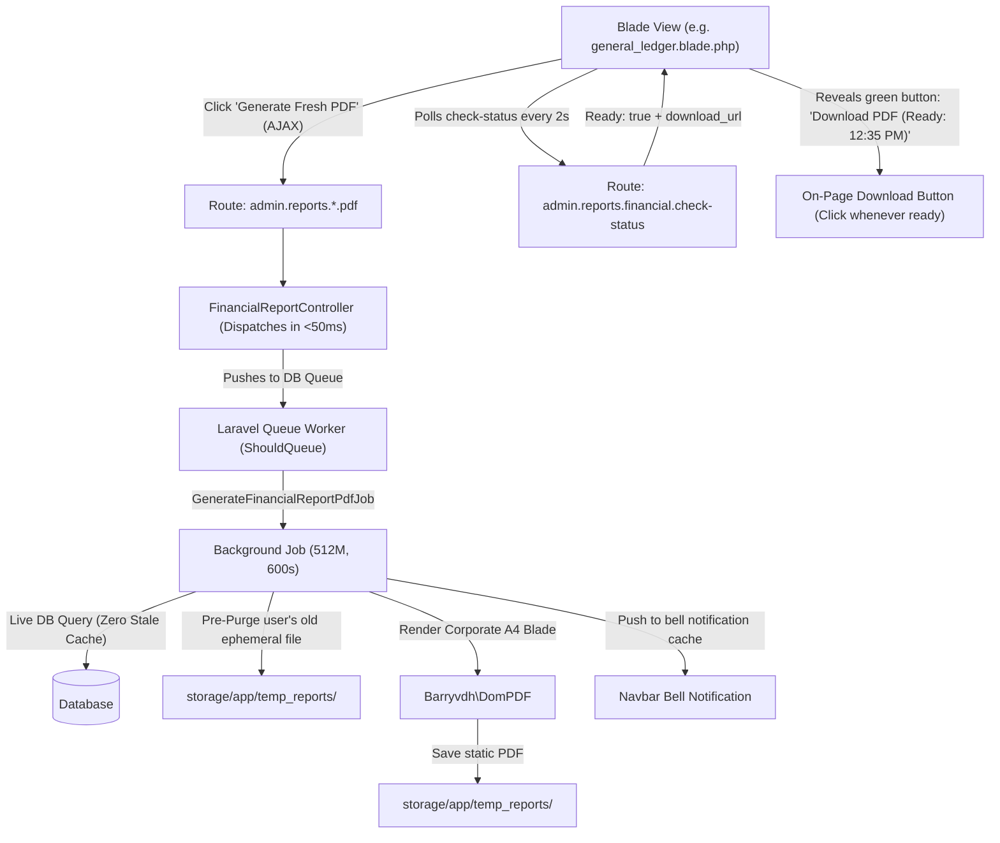

# 🚀 Feature Plan: Core Financial Statements Dynamic PDF Engine

**Module:** Core Financial Statements (Sub-section of Reports Menu)  
**System:** Copenhagen Tourist Point (b2bviking.com) — B2B Viking ERP  
**Controllers:** `App\Http\Controllers\Backend\FinancialReportController.php`  
**Standard:** Ephemeral Dynamic PDF Generation, Instant Auto-Purge & Stream, Zero Server Crashes (`docs/report/01_core_financial_statements/SKILL.md`)  
**Status:** Completed `[4/4 Completed]` ✅

---

## 🎯 1. Overview & Objectives

This feature replaces unreliable browser `window.print()` and missing export capabilities across all 4 Core Financial Statements with a unified, enterprise-grade **Ephemeral Dynamic PDF Engine**:

1. **General Ledger Statement:** Export filtered ledger entries (Account-wise or All Accounts, Date range, with Voucher No, Reference/Description, Debit, Credit, and Running Totals).
2. **Trial Balance Statement:** Export IFRS-compliant trial balance with Debit/Credit columns and Balanced verification badge.
3. **Profit & Loss Statement (P&L):** Export multi-step corporate income statement (Revenue, Operating Expenses, COGS, Gross Profit, Net Profit/Loss, Margin %).
4. **Balance Sheet Statement:** Export point-in-time financial position statement (Assets = Liabilities + Owner's Equity).

---

## 🛠️ 2. Architectural Blueprint & File Map

### New & Modified Files:
- **Queue Job Engine:**
  - `[NEW]` [GenerateFinancialReportPdfJob.php](file:///home/agent47/Sites/b2bvikingERP/app/Jobs/GenerateFinancialReportPdfJob.php)
- **Controller:**
  - `[MODIFY]` [FinancialReportController.php](file:///home/agent47/Sites/b2bvikingERP/app/Http/Controllers/Backend/FinancialReportController.php)
- **Routes:**
  - `[MODIFY]` [routes/web.php](file:///home/agent47/Sites/b2bvikingERP/routes/web.php)
- **PDF Blade Views:**
  - `[NEW]` [general_ledger_pdf.blade.php](file:///home/agent47/Sites/b2bvikingERP/resources/views/backend/reports/financial/pdf/general_ledger_pdf.blade.php)
  - `[NEW]` [trial_balance_pdf.blade.php](file:///home/agent47/Sites/b2bvikingERP/resources/views/backend/reports/financial/pdf/trial_balance_pdf.blade.php)
  - `[NEW]` [profit_loss_pdf.blade.php](file:///home/agent47/Sites/b2bvikingERP/resources/views/backend/reports/financial/pdf/profit_loss_pdf.blade.php)
  - `[NEW]` [balance_sheet_pdf.blade.php](file:///home/agent47/Sites/b2bvikingERP/resources/views/backend/reports/financial/pdf/balance_sheet_pdf.blade.php)
- **UI Blade Views & Partials (Asynchronous button + On-Page Ready Download Button):**
  - `[NEW]` [async_pdf_js.blade.php](file:///home/agent47/Sites/b2bvikingERP/resources/views/backend/reports/financial/partials/async_pdf_js.blade.php)
  - `[MODIFY]` [general_ledger.blade.php](file:///home/agent47/Sites/b2bvikingERP/resources/views/backend/reports/financial/general_ledger.blade.php)
  - `[MODIFY]` [trial_balance.blade.php](file:///home/agent47/Sites/b2bvikingERP/resources/views/backend/reports/financial/trial_balance.blade.php)
  - `[MODIFY]` [profit_loss.blade.php](file:///home/agent47/Sites/b2bvikingERP/resources/views/backend/reports/financial/profit_loss.blade.php)
  - `[MODIFY]` [balance_sheet.blade.php](file:///home/agent47/Sites/b2bvikingERP/resources/views/backend/reports/financial/balance_sheet.blade.php)
- **Automated Feature Test:**
  - `[NEW]` [FinancialReportPdfTest.php](file:///home/agent47/Sites/b2bvikingERP/tests/Feature/Controllers/Reports/FinancialReportPdfTest.php)

---

## 📋 3. Step-by-Step Implementation Checklist

### Phase 1: Controller & Route Setup
- [x] Add `declare(strict_types=1);` to `FinancialReportController.php`.
- [x] Create `GenerateFinancialReportPdfJob` implementing `ShouldQueue` with 512MB RAM and 600s timeout.
- [x] Implement non-blocking queue dispatchers in `FinancialReportController` (< 50ms response).
- [x] Implement `checkReportStatus` endpoint for live client polling.
- [x] Implement `downloadReportPdf` serving static PDF from `storage/app/temp_reports/`.
- [x] Register routes in `routes/web.php`.

### Phase 2: PDF Template Creation (Corporate A4 Layout)
- [x] Create `general_ledger_pdf.blade.php` (A4 landscape).
- [x] Create `trial_balance_pdf.blade.php` (A4 portrait).
- [x] Create `profit_loss_pdf.blade.php` (A4 portrait).
- [x] Create `balance_sheet_pdf.blade.php` (A4 portrait).

### Phase 3: Blade UI Enhancements (On-Page Ready Button)
- [x] Created `async_pdf_js.blade.php` partial handling AJAX dispatch, loading spinners, and polling.
- [x] Added green `Download PDF (Ready: {time})` button to `general_ledger.blade.php`.
- [x] Added green `Download PDF (Ready: {time})` button to `trial_balance.blade.php`.
- [x] Added green `Download PDF (Ready: {time})` button to `profit_loss.blade.php`.
- [x] Added green `Download PDF (Ready: {time})` button to `balance_sheet.blade.php`.
- [x] Preserved top navbar notification bell icon as persistent backup.

### Phase 4: Automated Testing & Verification
- [x] Created `tests/Feature/Controllers/Reports/FinancialReportPdfTest.php`.
- [x] Tested queue dispatch, job execution, file purge, status polling, and view rendering.
- [x] Run test suite: `php artisan test tests/Feature/Controllers/Reports/FinancialReportPdfTest.php` -> **11 passed (41 assertions) ✅**

---

## 🛡️ 4. Acceptance Criteria & Guarantees

1. **Zero HTTP 503 Live Server Crashes:** PDF generation runs isolated in background queue workers; HTTP controller dispatches in < 50ms.
2. **Zero Force Auto-Downloads:** PDF is NOT abruptly forced onto the user via automatic popup. A dedicated on-page button displays when ready, allowing the user to download at their convenience.
3. **Zero Stale Data Guarantee:** Every job queries live database transactions at runtime.
4. **Zero Storage Leaks:** Pre-generation auto-purge removes previous files for the user.
5. **No Dummy Data:** Fake CVR/VAT numbers removed; company information displayed cleanly.
