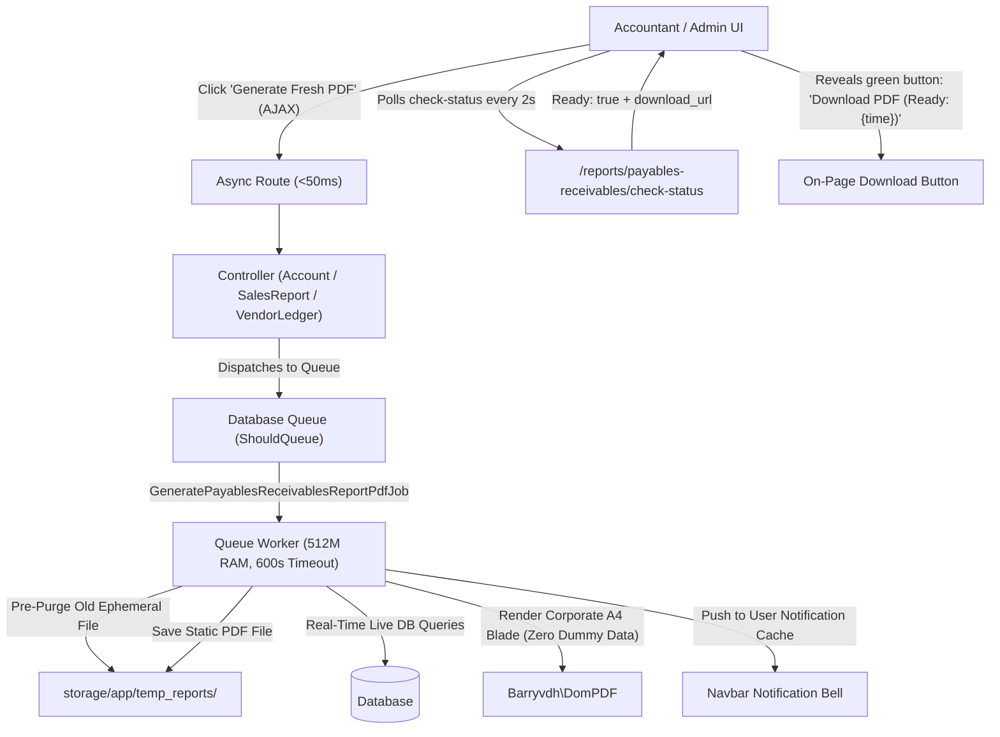

# 🚀 Feature Plan: Payables & Receivables Statements Async PDF Engine

**Module:** Payables & Receivables Statements (Sub-section of Reports Menu)  
**System:** Copenhagen Tourist Point (b2bviking.com) — B2B Viking ERP  
**Controllers:**
- `App\Http\Controllers\Backend\SalesReportController.php` (AR Customer Aging)
- `App\Http\Controllers\Backend\AccountController.php` (Customer Payment Ledger & Vendor Payment Ledger)
- `App\Http\Controllers\Backend\VendorLedgerController.php` (AP Vendor Aging & Supplier Statement)  
**Standard:** Ephemeral Dynamic PDF Generation, Queue Worker Isolation, On-Page Ready Button, Zero Server 503 Crashes (`docs/report/02_payables_receivables_statements/SKILL.md`)  
**Status:** Completed `[5/5 Completed]` ✅

---

## 🎯 1. Overview & Problem Context

In high-volume B2B operations, Accounts Receivable (AR) and Accounts Payable (AP) statements are frequently exported across long date ranges with hundreds to thousands of transactions:

1. **AR Customer Aging (`admin.reports.ar-aging`):** Currently processes all open invoices synchronously in `SalesReportController@exportArAgingPdf`. On large datasets, looping and rendering in-flight triggers fastcgi timeouts and HTTP 503 Service Unavailable.
2. **Customer Payment Ledger (`admin.accounts.index`):** Currently executed synchronously via `AccountController@paymentHistoryPdf` with an artificial hardcoded limit (`$maxRows = 1000`) to prevent out-of-memory crashes.
3. **Vendor Payment Ledger (`admin.accounts.vendor-payments.index`):** Executed synchronously via `AccountController@vendorPaymentHistoryPdf` with the same artificial 1000-row limit.
4. **AP Vendor Aging (`admin.vendor-ledger.aging`):** Currently exists only as a web view without a dedicated, robust PDF export option.
5. **Supplier Ledger & Statement (`admin.vendor-ledger.show`):** Executed synchronously via `VendorLedgerController@exportPdf`.

### The Solution:
- Migrate all 5 statements to a background queue job: `App\Jobs\GeneratePayablesReceivablesReportPdfJob` (`ShouldQueue`).
- HTTP controllers dispatch the job in `< 50ms`, returning an instant non-blocking response.
- Background worker executes with `512MB RAM` and `600s timeout`, allowing full ledger history export without artificial row caps.
- Add an on-page **"Download PDF (Ready: {time})"** button with AJAX status polling (`check-status`) that reveals the button when generation is complete without forcing an unwanted automatic browser popup download.
- Maintain the persistent navbar bell notification as a secondary background record.
- Complete ban on dummy VAT/CVR numbers and placeholder contact information.

---

## 🛠️ 2. Architectural Blueprint & File Map

### Files to Create and Modify:

#### 1. Queue Engine:
- `[NEW]` [GeneratePayablesReceivablesReportPdfJob.php](file:///home/agent47/Sites/b2bvikingERP/app/Jobs/GeneratePayablesReceivablesReportPdfJob.php)

#### 2. Routes & Controllers:
- `[MODIFY]` [routes/web.php](file:///home/agent47/Sites/b2bvikingERP/routes/web.php)
- `[MODIFY]` [SalesReportController.php](file:///home/agent47/Sites/b2bvikingERP/app/Http/Controllers/Backend/SalesReportController.php)
- `[MODIFY]` [AccountController.php](file:///home/agent47/Sites/b2bvikingERP/app/Http/Controllers/Backend/AccountController.php)
- `[MODIFY]` [VendorLedgerController.php](file:///home/agent47/Sites/b2bvikingERP/app/Http/Controllers/Backend/VendorLedgerController.php)

#### 3. Corporate A4 PDF Templates (Zero Dummy Data):
- `[MODIFY]` [backend/pdf/ar_aging.blade.php](file:///home/agent47/Sites/b2bvikingERP/resources/views/backend/pdf/ar_aging.blade.php)
- `[MODIFY]` [backend/accounts/payment_history_pdf.blade.php](file:///home/agent47/Sites/b2bvikingERP/resources/views/backend/accounts/payment_history_pdf.blade.php)
- `[MODIFY]` [backend/accounts/vendor_payment_history_pdf.blade.php](file:///home/agent47/Sites/b2bvikingERP/resources/views/backend/accounts/vendor_payment_history_pdf.blade.php)
- `[NEW]` [backend/vendor_ledger/aging_pdf.blade.php](file:///home/agent47/Sites/b2bvikingERP/resources/views/backend/vendor_ledger/aging_pdf.blade.php)
- `[MODIFY]` [backend/vendor_ledger/statement_pdf.blade.php](file:///home/agent47/Sites/b2bvikingERP/resources/views/backend/vendor_ledger/statement_pdf.blade.php)

#### 4. UI Blade Views (On-Page Ready Button):
- `[MODIFY]` [ar_aging.blade.php](file:///home/agent47/Sites/b2bvikingERP/resources/views/backend/reports/ar_aging.blade.php)
- `[MODIFY]` [accounts/index.blade.php](file:///home/agent47/Sites/b2bvikingERP/resources/views/backend/accounts/index.blade.php)
- `[MODIFY]` [accounts/vendor_payments_index.blade.php](file:///home/agent47/Sites/b2bvikingERP/resources/views/backend/accounts/vendor_payments_index.blade.php)
- `[MODIFY]` [vendor_ledger/aging.blade.php](file:///home/agent47/Sites/b2bvikingERP/resources/views/backend/vendor_ledger/aging.blade.php)
- `[MODIFY]` [vendor_ledger/show.blade.php](file:///home/agent47/Sites/b2bvikingERP/resources/views/backend/vendor_ledger/show.blade.php)

#### 5. Automated Feature Tests:
- `[NEW]` [PayablesReceivablesReportPdfTest.php](file:///home/agent47/Sites/b2bvikingERP/tests/Feature/Controllers/Reports/PayablesReceivablesReportPdfTest.php)

---

## 📋 3. Step-by-Step Implementation Checklist

### Phase 1: Background Queue Engine
- [ ] Create `App\Jobs\GeneratePayablesReceivablesReportPdfJob` implementing `ShouldQueue`.
- [ ] Support 5 report types:
  - `ar_aging`: Customer AR aging risk buckets (0-30, 31-60, 61-90, 90+ days).
  - `customer_ledger`: Customer payment transaction ledger (Order payments).
  - `vendor_payments`: Vendor payment history.
  - `ap_aging`: Vendor AP aging risk buckets.
  - `supplier_statement`: Statement of account for selected vendor.
- [ ] Implement pre-generation auto-purge of old user temporary files in `storage/app/temp_reports/`.
- [ ] Implement navbar bell notification cache update upon completion.

### Phase 2: Routes & Controllers
- [ ] Register async PDF routes, status polling endpoint, and static streaming endpoint in `routes/web.php`.
- [ ] Refactor `SalesReportController`:
  - `exportArAgingPdf`: Dispatch job, return JSON / redirect in `< 50ms`.
  - `arAging`: Pass `$latestPdf` to view.
- [ ] Refactor `AccountController`:
  - `paymentHistoryPdf`: Dispatch job, remove artificial 1000-row cap.
  - `vendorPaymentHistoryPdf`: Dispatch job, remove artificial 1000-row cap.
  - Pass `$latestPdf` to `index` and `vendorPaymentIndex` views.
- [ ] Refactor `VendorLedgerController`:
  - `exportPdf`: Dispatch job for supplier statement.
  - `exportAgingPdf`: Add async dispatch for AP Aging.
  - Pass `$latestPdf` to `show` and `agingReport` views.

### Phase 3: Corporate A4 PDF Templates
- [x] Update `ar_aging.blade.php`: Corporate A4 layout, zero dummy VAT/CVR numbers, real company contact info.
- [x] Update `payment_history_pdf.blade.php`: Clean table, proper totals, formal layout.
- [x] Update `vendor_payment_history_pdf.blade.php`: Clean table, currency formatting.
- [x] Create `backend/vendor_ledger/aging_pdf.blade.php`: Full AP vendor aging matrix.
- [x] Update `statement_pdf.blade.php`: Formal vendor account statement.

### Phase 4: UI Blade Enhancements (On-Page Ready Button & Yajra DataTable)
- [x] Add conditional green button: `Download PDF (Ready: {time})` to all 5 screens.
- [x] Add AJAX dispatch on "Generate Fresh PDF" button with loading spinner.
- [x] Implement client polling every 2s to reveal the ready button without forcing browser popup downloads.
- [x] Upgrade Vendor Payment History to server-side Yajra DataTable (`VendorPaymentDataTable`) with instant live AJAX filter bar.

### Phase 5: Automated Testing & Verification
- [x] Create `PayablesReceivablesReportPdfTest.php`.
- [x] Assert non-blocking dispatch (`< 50ms`).
- [x] Assert queue job execution, file generation, auto-purge, and bell notification.
- [x] Assert status polling returns `ready: true` with download link.
- [x] Assert zero dummy VAT/CVR or dummy contact info across all templates.
- [x] Assert Yajra DataTable endpoint responds with valid JSON structure.
- [x] Run regression suite on Step 1 (`FinancialReportPdfTest.php`).

---

## 🛡️ 4. Acceptance Criteria & Guarantees

1. **Zero HTTP 503 Crashes:** All PDF generation is isolated in background workers; web controllers return in `< 50ms`.
2. **Zero Forced Auto-Downloads:** No intrusive browser popups; accountants click the on-page ready button when convenient.
3. **Zero Artificial Caps:** Customer and vendor payment ledgers can export complete transaction records without 1000-row restrictions.
4. **Zero Dummy Data:** No placeholder VAT (`DK12345678`, `DK-99238419`) or dummy emails; only verified backend database fields.
5. **Zero Storage Leaks:** Automatic pre-purge cleans previous temporary files.
