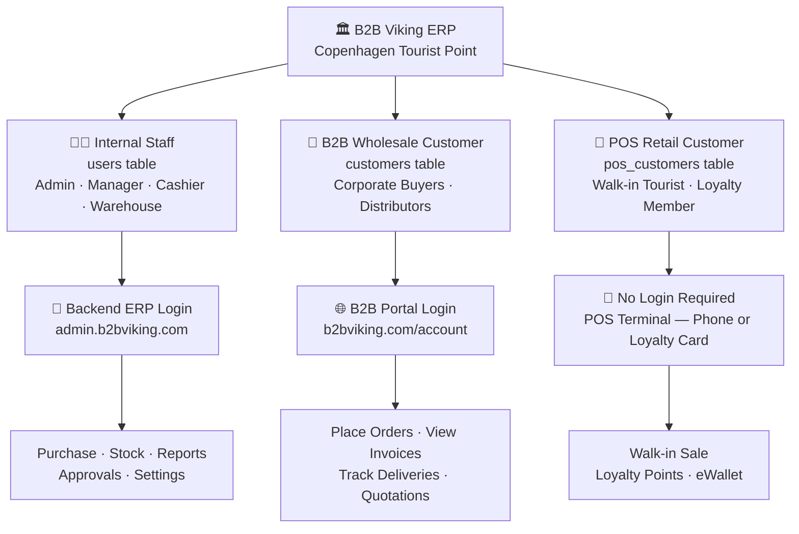
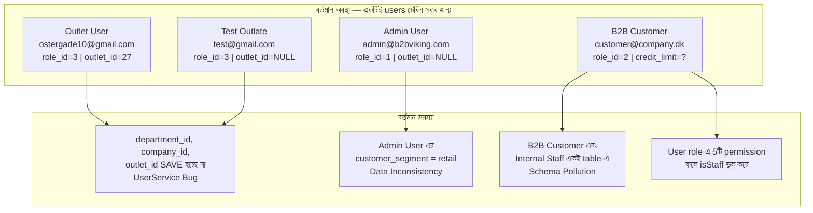
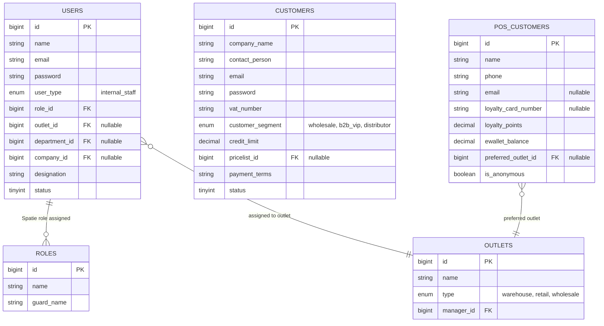
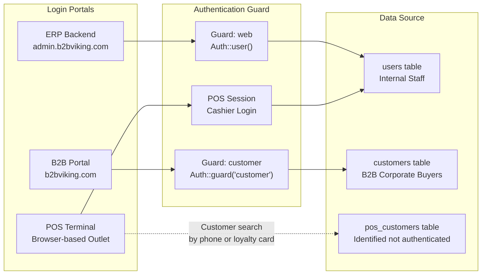
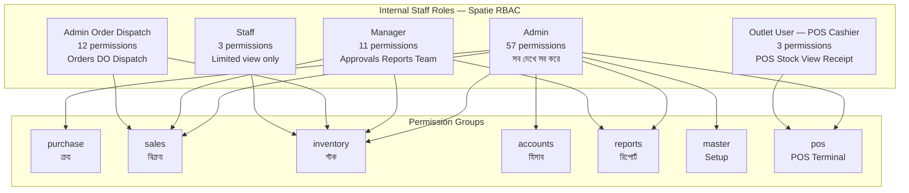
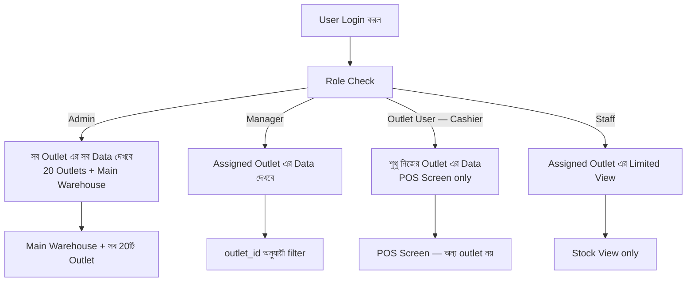
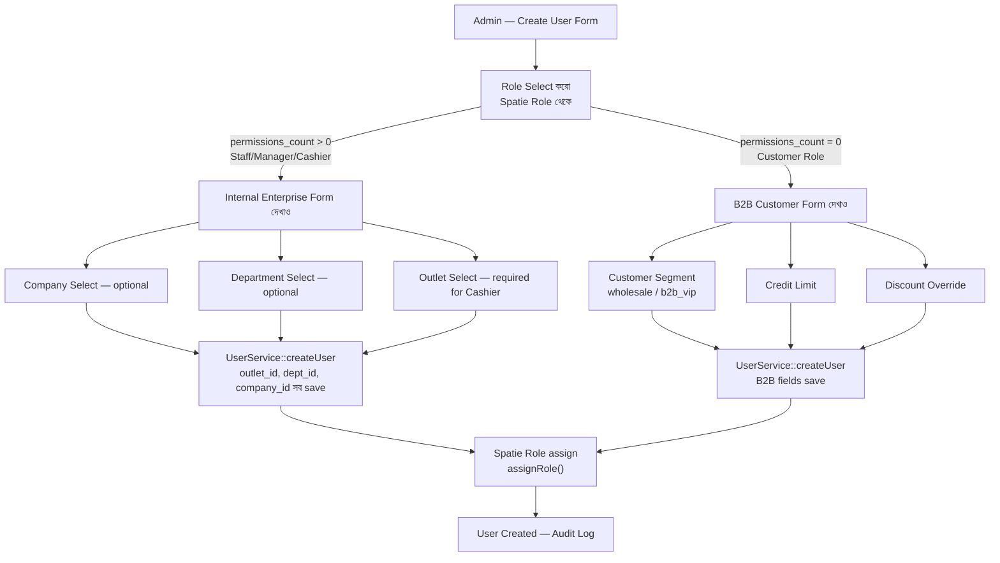
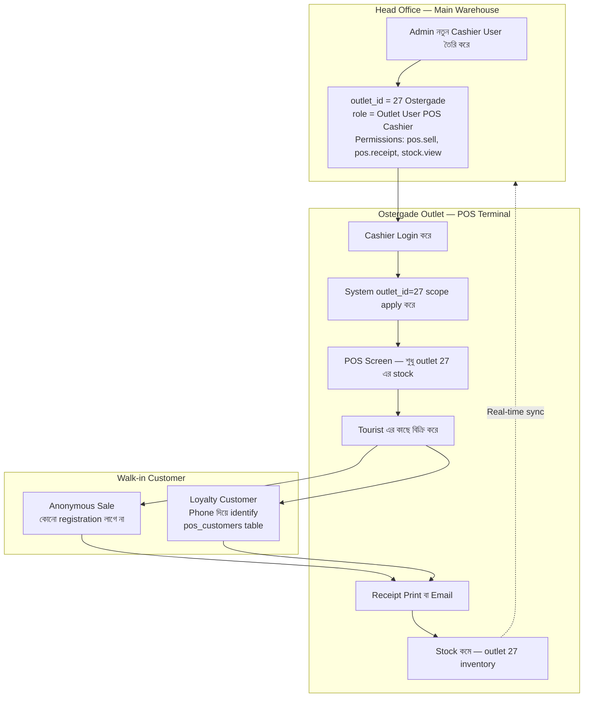
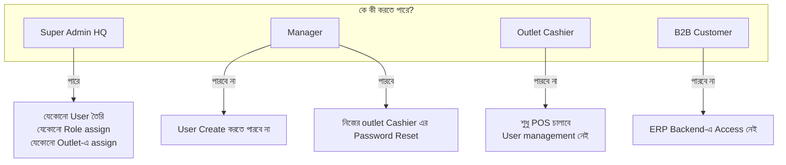

# 👥 User Management Architecture
**B2B Viking ERP — Copenhagen Tourist Point**
**Document Version:** 1.0
**Last Updated:** August 2026
**Status:** Living Document

---

## 1. System Overview — তিন ধরনের User Identity

আপনার ব্যবসায় তিনটি সম্পূর্ণ আলাদা user identity আছে। প্রতিটির login channel, data structure, এবং system access আলাদা।

---

## 2. Current State — এখন System যেভাবে আছে

### 2.1 Live Database (Production: b2bvikingerp)

| Metric | Value |
|:---|:---:|
| Total Users in `users` table | **33** |
| Total Roles | **6** |
| Total Permissions | **57** |
| Users with Spatie Role assigned | **33 (100%)** |

### 2.2 Current Role Structure

| Role Name | Permissions | Type |
|:---|:---:|:---|
| Admin | 57 | Internal Staff ✅ |
| Admin - Order Receive & Despatch | 12 | Internal Staff ✅ |
| Manager | 11 | Internal Staff ✅ |
| User | 5 | ⚠️ Ambiguous — B2B Customer? |
| Outlet User | 3 | Internal Staff (Cashier) ✅ |
| Staff | 3 | Internal Staff ✅ |

### 2.3 Current Architecture Flowchart

---

## 3. Target Architecture — সঠিক Design

### 3.1 Database Entity Relationship

### 3.2 Login Flow — কে কোথায় Login করে

---

## 4. Spatie RBAC — Role এবং Permission Map

### 4.1 Role Hierarchy

### 4.2 Outlet Scoping — কে কতটুকু দেখবে

---

## 5. User Create Flow — নতুন User কীভাবে তৈরি হয়

---

## 6. POS Outlet Flow — Outlet এ কীভাবে কাজ হবে

---

## 7. Who Can Manage Users — Control Matrix

---

## 8. Implementation Roadmap

### Phase A — Critical Bug Fix (এখনই)

| Task | File | Status |
|:---|:---|:---:|
| `outlet_id`, `dept_id`, `company_id` save করা | `UserService.php` | 🔴 Pending |
| Validation rules add করা | `StoreUserRequest.php` + `UpdateUserRequest.php` | 🔴 Pending |
| `user_type` enum column | New Migration | 🔴 Pending |
| `"User"` role এর 5 permissions clean করা | Database | 🔴 Pending |

### Phase B — B2B Customer Separation

| Task | Description | Status |
|:---|:---|:---:|
| `customers` table migration | Schema design | 🟡 Planned |
| B2B Customer data migrate | Script | 🟡 Planned |
| B2B Portal Auth Guard | `config/auth.php` | 🟡 Planned |
| Sales dropdown update | `SalesQuotationController` | 🟡 Planned |

### Phase C — POS Module (20 Outlets)

| Task | Description | Status |
|:---|:---|:---:|
| `pos_customers` table migration | Schema | ⚪ Future |
| `POS Cashier` Spatie role | Permission seeder | ⚪ Future |
| POS Terminal UI | Browser-based 20 outlets | ⚪ Future |
| Offline mode | Service Worker | ⚪ Future |

---

## 9. Quick Reference Summary

| Component | বর্তমান অবস্থা | Target Design | Priority |
|:---|:---|:---|:---:|
| Internal Staff storage | `users` table ✅ | `users` table ✅ | Done |
| B2B Customer storage | `users` table ⚠️ | `customers` table | Phase B |
| POS Customer storage | নেই ❌ | `pos_customers` table | Phase C |
| `outlet_id` save হওয়া | হচ্ছে না ❌ | UserService fix | 🔴 Phase A |
| `department_id` save হওয়া | হচ্ছে না ❌ | UserService fix | 🔴 Phase A |
| `company_id` save হওয়া | হচ্ছে না ❌ | UserService fix | 🔴 Phase A |
| `user_type` explicit column | নেই ❌ | Migration | 🔴 Phase A |
| Outlet-level user create | Central only ✅ | Central only ✅ | Done |
| POS Cashier role | নেই ❌ | Spatie role | Phase C |
| Spatie RBAC core | কাজ করছে ✅ | কাজ করছে ✅ | Done |
| Sidebar permission guards | কাজ করছে ✅ | কাজ করছে ✅ | Done |
