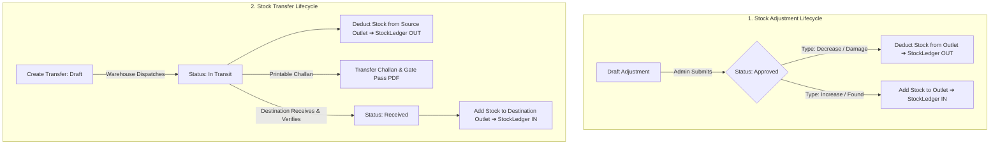

# Enterprise Stock Adjustment & Stock Transfer Implementation Plan

- **Document Version:** 1.0.0
- **Created Date:** 2026-08-19
- **Project:** B2B Viking ERP
- **Module Focus:** Complete Inventory Management Modernization (Stock Adjustments & Multi-Outlet Transfers)
- **Status:** Approved for Implementation

---

## 🎯 Executive Summary & Architectural Goal

With the successful decoupling of customer sales from legacy `Issue` to `DeliveryOrder` (Challan), all customer order fulfillment is now standardized. 

To complete the transformation into a true **Tier-1 Enterprise ERP (SAP / Odoo standard)**, we are eliminating the legacy `Issue` menu and introducing two mission-critical, enterprise-grade inventory modules:

1. **`Stock Adjustment` (ADJ):**
   - Handles physical inventory counts, cycle count variances, damaged/expired goods write-offs, marketing sample dispatches, internal store consumption, and stock overage/shortage reconciliation.
   - Comprehensive audit trail, reason codes, cost calculation, and direct integration with `StockLedger`.

2. **`Stock Transfer` (TRN):**
   - Handles physical stock movements between Central Warehouses, Hubs, Branches, and Outlets.
   - Professional logistics pipeline: **Draft ➔ Dispatched (In Transit) ➔ Received & Verified (Destination Stock-In)**.
   - Generates official **Stock Transfer Challan / Gate Pass PDF** with vehicle, driver, and transit tracking.

---

## 🗄️ Database Schema Design

### 1. Table: `stock_adjustments`
```sql
CREATE TABLE `stock_adjustments` (
  `id` bigint unsigned NOT NULL AUTO_INCREMENT,
  `adjustment_no` varchar(50) NOT NULL UNIQUE,
  `outlet_id` bigint unsigned NOT NULL DEFAULT 1,
  `adjusted_by` bigint unsigned NOT NULL,
  `approved_by` bigint unsigned NULL,
  `adjustment_type` enum('increase', 'decrease', 'reconciliation') NOT NULL,
  `reason_code` enum('damage', 'physical_count', 'expired', 'sample_marketing', 'theft_loss', 'internal_use', 'other') NOT NULL,
  `status` enum('draft', 'approved', 'cancelled') NOT NULL DEFAULT 'draft',
  `total_items_count` int NOT NULL DEFAULT 0,
  `total_adjusted_cost` decimal(15,2) NOT NULL DEFAULT 0.00,
  `note` text NULL,
  `attachment` varchar(255) NULL,
  `created_at` timestamp NULL,
  `updated_at` timestamp NULL
);
```

### 2. Table: `stock_adjustment_items`
```sql
CREATE TABLE `stock_adjustment_items` (
  `id` bigint unsigned NOT NULL AUTO_INCREMENT,
  `stock_adjustment_id` bigint unsigned NOT NULL,
  `product_id` bigint unsigned NOT NULL,
  `variant_id` bigint unsigned NULL,
  `system_qty` decimal(12,2) NOT NULL DEFAULT 0.00,
  `counted_qty` decimal(12,2) NOT NULL DEFAULT 0.00,
  `adjusted_qty` decimal(12,2) NOT NULL DEFAULT 0.00,
  `unit_cost` decimal(15,2) NOT NULL DEFAULT 0.00,
  `total_cost` decimal(15,2) NOT NULL DEFAULT 0.00,
  `item_note` varchar(255) NULL,
  `created_at` timestamp NULL,
  `updated_at` timestamp NULL
);
```

### 3. Table: `stock_transfers`
```sql
CREATE TABLE `stock_transfers` (
  `id` bigint unsigned NOT NULL AUTO_INCREMENT,
  `transfer_no` varchar(50) NOT NULL UNIQUE,
  `from_outlet_id` bigint unsigned NOT NULL,
  `to_outlet_id` bigint unsigned NOT NULL,
  `initiated_by` bigint unsigned NOT NULL,
  `dispatched_by` bigint unsigned NULL,
  `received_by` bigint unsigned NULL,
  `status` enum('draft', 'dispatched', 'received', 'cancelled') NOT NULL DEFAULT 'draft',
  `transfer_date` date NOT NULL,
  `dispatched_at` timestamp NULL,
  `received_at` timestamp NULL,
  `challan_no` varchar(100) NULL,
  `vehicle_no` varchar(100) NULL,
  `driver_name` varchar(150) NULL,
  `driver_phone` varchar(50) NULL,
  `note` text NULL,
  `total_items_count` int NOT NULL DEFAULT 0,
  `created_at` timestamp NULL,
  `updated_at` timestamp NULL
);
```

### 4. Table: `stock_transfer_items`
```sql
CREATE TABLE `stock_transfer_items` (
  `id` bigint unsigned NOT NULL AUTO_INCREMENT,
  `stock_transfer_id` bigint unsigned NOT NULL,
  `product_id` bigint unsigned NOT NULL,
  `variant_id` bigint unsigned NULL,
  `transfer_qty` decimal(12,2) NOT NULL DEFAULT 0.00,
  `received_qty` decimal(12,2) NULL,
  `unit_cost` decimal(15,2) NOT NULL DEFAULT 0.00,
  `item_note` varchar(255) NULL,
  `created_at` timestamp NULL,
  `updated_at` timestamp NULL
);
```

---

## ⚙️ Business Logic & StockLedger Lifecycle



---

## 📁 File-by-File Implementation Plan

### 1. Migrations & Models
- `database/migrations/2026_08_19_000001_create_stock_adjustments_tables.php`
- `database/migrations/2026_08_19_000002_create_stock_transfers_tables.php`
- `app/Models/StockAdjustment.php` & `app/Models/StockAdjustmentItem.php`
- `app/Models/StockTransfer.php` & `app/Models/StockTransferItem.php`

### 2. Services & Dedicated Handlers
- `app/Services/Inventory/StockAdjustmentService.php`
  - Handles validation, stock deduction/increment, cost computation, and `StockLedger` audit logging.
- `app/Services/Inventory/StockTransferService.php`
  - Handles transfer lifecycle (Dispatching source stock ➔ In-Transit ➔ Receiving destination stock ➔ Ledger sync).

### 3. Controllers & DataTables
- `app/Http/Controllers/Backend/StockAdjustmentController.php`
  - CRUD, Approval, Cancellation, Dynamic Item Stock Fetcher.
- `app/Http/Controllers/Backend/StockTransferController.php`
  - CRUD, Dispatch, Receive verification, PDF Gate Pass Download.
- `app/DataTables/StockAdjustmentDataTable.php`
- `app/DataTables/StockTransferDataTable.php`

### 4. Blade Views & UI Components
- `resources/views/backend/stock_adjustments/index.blade.php`, `create.blade.php`, `show.blade.php`
- `resources/views/backend/stock_transfers/index.blade.php`, `create.blade.php`, `show.blade.php`, `receive.blade.php`, `pdf.blade.php`

### 5. Sidebar Navigation Modernization
- Update `resources/views/backend/layouts/sidebar.blade.php`:
  - Under `Inventory System` menu:
    - 📦 **Current Stock** (`route('admin.inventory-reports.index')`)
    - ⚖️ **Stock Adjustments** (`route('admin.stock-adjustments.index')`)
    - 🚚 **Stock Transfers** (`route('admin.stock-transfers.index')`)
    - 📜 **Stock Ledger** (`route('admin.stock-ledger.index')`)
  - Completely remove legacy `Stock Issues` and `Issue Returns` menu items.

---

## 🧪 Verification & Acceptance Criteria

1. **Stock Adjustment Verification:**
   - Create a `decrease` adjustment (Reason: Damage / 10 pcs). Approve it.
   - Verify warehouse stock is reduced by 10 pcs and `StockLedger` logs `reference_type = 'stock_adjustment'` with `out_qty = 10`.
2. **Stock Transfer Verification:**
   - Create transfer of 20 pcs from Main Warehouse (Outlet 1) to Branch (Outlet 2).
   - Click **Dispatch**: Verify Outlet 1 stock is reduced by 20 pcs and status is `dispatched`. Download Challan PDF.
   - Click **Receive**: Verify Outlet 2 stock is increased by 20 pcs and status is `received`.
3. **Sidebar Cleanliness:**
   - Verify sidebar only displays `Current Stock`, `Stock Adjustments`, `Stock Transfers`, and `Stock Ledger` with zero legacy issue clutter.
